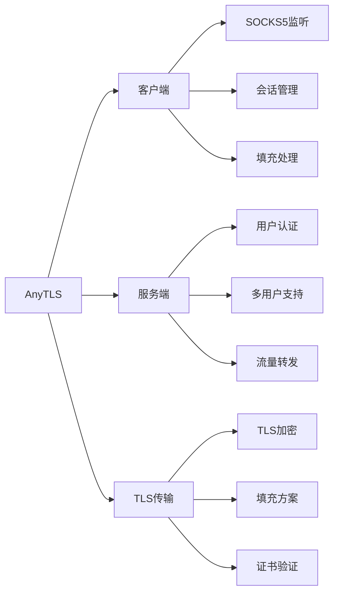
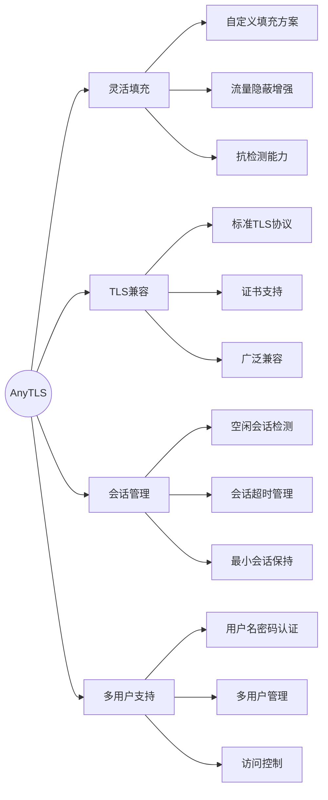
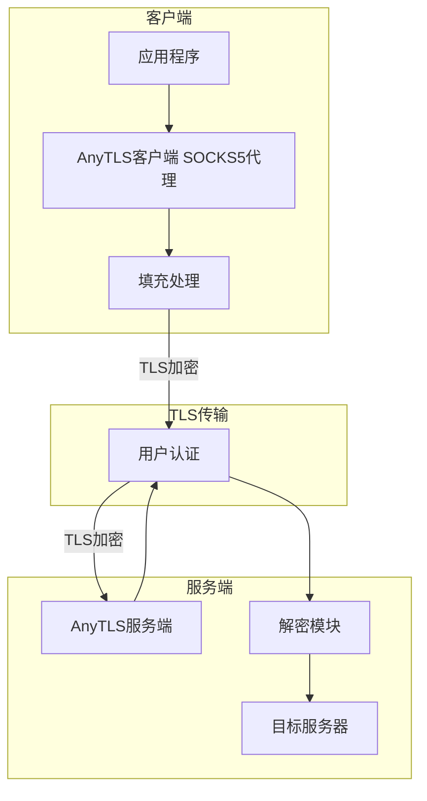
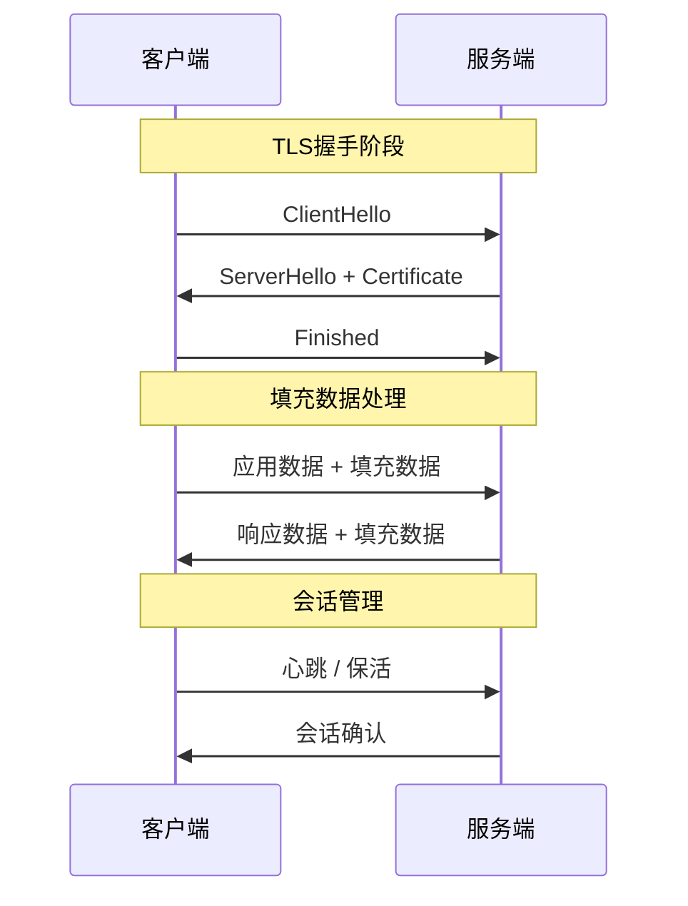

如果你正在找「AnyTLS 协议怎么用」，这篇可以直接当实战手册：先讲清 AnyTLS 是什么、和其他代理协议有什么差异，再一步步完成 sing-box 服务端部署与多平台客户端配置，最后给出常见报错和排查思路，方便你少踩坑、快速落地。

## 一、AnyTLS协议介绍

### 1.1 什么是AnyTLS协议

AnyTLS 是一个比较新的 TLS 代理协议，由 sing-box 团队维护。它的目标很直接：在保证安全性的前提下，把配置和使用门槛尽量压低，同时给进阶用户留下可调空间。

AnyTLS 的核心思路是把标准 TLS 当作传输外壳，再配合可自定义的填充策略（Padding Scheme）来提升流量隐蔽性，同时尽量维持性能和兼容性。



### 1.2 AnyTLS协议的发展历程

| 时间 | 事件 | 说明 |
|------|------|------|
| 2024 | 协议设计 | sing-box团队开始设计AnyTLS协议 |
| 2024 | 首个版本 | 在sing-box dev-next分支中发布 |
| 2025 | 功能完善 | 新增更多填充方案和会话管理功能 |
| 2026+ | 持续演进 | 多平台客户端支持，功能不断完善 |

主要版本特点：



### 1.3 设计理念与特点

#### 1.3.1 设计理念

AnyTLS的设计遵循以下原则：

* TLS兼容：基于标准TLS协议，确保广泛兼容性
* 灵活填充：支持自定义填充方案，增强流量隐蔽性
* 会话管理：完善的空闲会话检测和超时机制
* 简单配置：配置简洁，易于部署和维护
* 安全优先：使用现代加密算法，确保通信安全

#### 1.3.2 协议特点

| 特点 | 说明 |
|------|------|
| 基于TLS | 使用标准TLS协议传输，兼容性好 |
| 填充方案 | 支持自定义填充，增强隐蔽性 |
| 会话管理 | 空闲会话检测、超时机制 |
| 密码认证 | 简单的用户名密码认证 |
| 多用户支持 | 支持多用户管理 |
| TCP/UDP支持 | 同时支持TCP和UDP转发 |

### 1.4 适用场景

AnyTLS 比较适合下面这些场景：

* 流量隐蔽需求：需要TLS流量伪装的场景
* 实验性部署：对新协议感兴趣的技术用户
* 特定需求：需要自定义填充方案的代理方案
* 学习和研究：研究和学习代理协议
* 稳定网络环境：在稳定网络环境下使用

::: info 重要说明
AnyTLS 仍在持续迭代。和 VLESS、Hysteria2 这类成熟方案相比，它的生态和客户端支持还在补齐中，更适合愿意折腾、愿意做测试的用户先用起来。
:::

### 1.5 与其他代理协议对比

| 特性 | AnyTLS | VLESS | Trojan | Hysteria2 | TUIC |
|------|--------|-------|--------|-----------|------|
| 传输协议 | TCP/TLS | TCP/UDP | TCP | UDP(QUIC) | UDP(QUIC) |
| 加密方式 | TLS | TLS/XTLS | TLS | QUIC TLS | QUIC TLS |
| 流量伪装 | 填充方案 | Reality/WS | 强 | HTTP/3 | 弱 |
| 多用户支持 | 支持 | 支持 | 支持 | 支持 | 支持 |
| 性能 | 中 | 高 | 中 | 极高 | 高 |
| 配置复杂度 | 低 | 中 | 低 | 低 | 低 |
| 客户端支持 | sing-box | 广泛 | 广泛 | 较广 | 较广 |

## 二、协议工作原理

### 2.1 整体架构

AnyTLS采用客户端-服务器架构，基于TLS协议构建：



组件说明：

| 组件 | 功能|
|------|------|
| TLS连接 | 提供加密传输通道|
| 填充处理 | 添加填充数据，增强隐蔽性|
| 用户认证 | 验证客户端身份|
| 会话管理 | 管理连接会话生命周期|

### 2.2 填充方案机制

AnyTLS 会通过填充方案来增强流量隐蔽性：



### 2.3 填充方案详解

AnyTLS 支持自定义填充方案，下面是常见默认配置：

```routeros
默认填充方案：
┌──────────────────────────────────────────────────────────────────────┐
│ stop=8                                                 # 停止条件     │
│ 0=30-30                                                # 初始填充     │
│ 1=100-400                                              # 小数据填充   │
│ 2=400-500,c,500-1000,c,500-1000,c,500-1000,c,500-1000  # 中等数据     │
│ 3=9-9,500-1000                                         # 快速填充     │
│ 4=500-1000                                             # 大数据填充   │
│ 5=500-1000                                             # 备用填充     │
│ 6=500-1000                                             # 备用填充     │
│ 7=500-1000                                             # 备用填充     │
└──────────────────────────────────────────────────────────────────────┘
```

填充方案参数说明：

| 参数 | 说明 | 示例 |
|------|------|------|
| stop | 停止填充的连接数 | stop=8 |
| 数字范围 | 填充数据长度范围 | 100-400 |
| c | 继续填充标记 | 500-1000,c,500-1000 |

### 2.4 会话管理机制

AnyTLS 也提供了比较完整的会话管理能力：

```nix
会话管理参数：
┌────────────────────────────────────────────────────────────────┐
│ idle_session_check_interval: 30s    # 空闲会话检查间隔          │
│ idle_session_timeout: 30s           # 空闲会话超时时间          │
│ min_idle_session: 5                 # 最小空闲会话数量          │
└────────────────────────────────────────────────────────────────┘
```

会话管理流程：

1. 空闲检测：定期检查会话空闲状态
2. 超时处理：超过设定时间自动关闭空闲会话
3. 最小保持：保持一定数量的空闲会话以快速响应

### 2.5 认证机制

AnyTLS 采用用户名+密码的认证方式：

```text
认证流程：
┌────────────────────────────────────────────────────────────────┐
│ 1. 客户端发起TLS连接                                            │
│ 2. 完成TLS握手                                                 │
│ 3. 客户端发送用户名和密码                                       │
│ 4. 服务端验证用户身份                                           │
│ 5. 验证通过后建立代理通道                                        │
└────────────────────────────────────────────────────────────────┘
```

## 三、服务端部署教程

### 3.1 环境准备

#### 3.1.1 服务器要求

| 项目 | 最低要求 | 推荐配置 |
|------|----------|----------|
| CPU | 1核 | 2核+ |
| 内存 | 256MB | 1GB+ |
| 存储 | 5GB | 20GB+ |
| 带宽 | 10Mbps | 100Mbps+ |
| 系统 | Debian 10+/Ubuntu 18.04+/CentOS 7+ | 最新稳定版 |

### 3.1.2 端口规划

| 服务 | 端口 | 说明 |
|------|------|------|
| AnyTLS | 443/TCP | 推荐使用443端口 |
| AnyTLS | 自定义 | 可修改端口 |

### 3.2 安装sing-box

目前 AnyTLS 的主流实现就是 sing-box，所以服务端部署基本都围绕 sing-box 来做。

#### 3.2.1 使用官方脚本安装

```bash
# 下载安装脚本
curl -fsSL https://sing-box.app/deb-install.sh | sh

# 或者使用apt安装（Debian/Ubuntu）
curl -fsSL https://deb.sagernet.org/pubkey.gpg | sudo gpg --dearmor -o /etc/apt/keyrings/sagernet.gpg
echo "deb [signed-by=/etc/apt/keyrings/sagernet.gpg] https://deb.sagernet.org/ * *" | sudo tee /etc/apt/sources.list.d/sagernet.list
sudo apt update
sudo apt install sing-box
```

#### 3.2.2 手动安装二进制

```bash
# 下载最新版本
SING_BOX_VERSION=$(curl -s https://api.github.com/repos/SagerNet/sing-box/releases/latest | grep '"tag_name"' | sed -E 's/.*"v([^"]+)".*/\1/')
wget https://github.com/SagerNet/sing-box/releases/download/v${SING_BOX_VERSION}/sing-box-${SING_BOX_VERSION}-linux-amd64.tar.gz

# 解压安装
tar -xzf sing-box-*-linux-amd64.tar.gz
sudo mv sing-box /usr/local/bin/
sudo chmod +x /usr/local/bin/sing-box

# 验证安装
sing-box version
```

#### 3.2.3 Docker安装

```bash
# 拉取镜像
docker pull singbox/sing-box:latest

# 创建配置目录
sudo mkdir -p /etc/sing-box

# 运行容器（需要先创建配置文件）
docker run -d \
  --name sing-box \
  --restart=always \
  -v /etc/sing-box:/etc/sing-box \
  -p 443:443 \
  singbox/sing-box:latest \
  run -c /etc/sing-box/config.json
```

### 3.3 获取TLS证书

AnyTLS 依赖 TLS 证书，通常用 ACME 自动签发会更省心。

#### 3.3.1 使用acme.sh获取证书

```bash
# 安装acme.sh
curl https://get.acme.sh | sh

# 设置默认CA
~/.acme.sh/acme.sh --set-default-ca --server letsencrypt

# 获取证书（需要域名已解析到服务器）
~/.acme.sh/acme.sh --issue -d your-domain.com --standalone

# 安装证书到指定目录
~/.acme.sh/acme.sh --install-cert -d your-domain.com \
  --key-file       /etc/sing-box/privkey.pem  \
  --fullchain-file /etc/sing-box/fullchain.pem \
  --reloadcmd      "systemctl restart sing-box"
```

#### 3.3.2 使用certbot获取证书

```bash
# 安装certbot
sudo apt install certbot

# 获取证书
sudo certbot certonly --standalone -d your-domain.com

# 复制证书到sing-box目录
sudo cp /etc/letsencrypt/live/your-domain.com/fullchain.pem /etc/sing-box/
sudo cp /etc/letsencrypt/live/your-domain.com/privkey.pem /etc/sing-box/

# 设置自动续签
sudo systemctl enable certbot.timer
```

### 3.4 配置AnyTLS服务端

#### 3.4.1 基础配置文件

创建配置文件 `/etc/sing-box/config.json`：

```json
{
  "log": {
    "level": "info",
    "timestamp": true
  },
  "inbounds": [
    {
      "type": "anytls",
      "tag": "anytls-in",
      "listen": "::",
      "listen_port": 443,
      "users": [
        {
          "name": "user1",
          "password": "your_password_here"
        }
      ],
      "tls": {
        "enabled": true,
        "server_name": "your-domain.com",
        "key_path": "/etc/sing-box/privkey.pem",
        "certificate_path": "/etc/sing-box/fullchain.pem"
      }
    }
  ],
  "outbounds": [
    {
      "type": "direct",
      "tag": "direct"
    }
  ]
}
```

#### 3.4.2 完整配置示例

```json
{
  "log": {
    "level": "info",
    "output": "/var/log/sing-box/access.log",
    "timestamp": true
  },
  "inbounds": [
    {
      "type": "anytls",
      "tag": "anytls-in",
      "listen": "::",
      "listen_port": 443,
      "users": [
        {
          "name": "user1",
          "password": "password_for_user1"
        },
        {
          "name": "user2",
          "password": "password_for_user2"
        }
      ],
      "padding_scheme": [
        "stop=8",
        "0=30-30",
        "1=100-400",
        "2=400-500,c,500-1000,c,500-1000,c,500-1000,c,500-1000",
        "3=9-9,500-1000",
        "4=500-1000",
        "5=500-1000",
        "6=500-1000",
        "7=500-1000"
      ],
      "tls": {
        "enabled": true,
        "server_name": "your-domain.com",
        "key_path": "/etc/sing-box/privkey.pem",
        "certificate_path": "/etc/sing-box/fullchain.pem"
      }
    }
  ],
  "outbounds": [
    {
      "type": "direct",
      "tag": "direct"
    }
  ],
  "route": {
    "final": "direct"
  }
}
```

### 3.5 配置参数说明

#### 3.5.1 Inbound部分

| 参数 | 说明 | 示例值 |
|------|------|------|
| type | 协议类型 | anytls |
| tag | 标签名称 | anytls-in |
| listen | 监听地址 | ::（IPv6）或 0.0.0.0 |
| listen\_port | 监听端口 | 443 |
| users | 用户列表 | 用户名密码数组 |
| padding\_scheme | 填充方案 | 数组形式 |
| tls | TLS配置 | 证书和密钥路径 |

#### 3.5.2 用户配置

| 参数 | 说明 | 示例值 |
|------|------|------|
| name | 用户名 | user1 |
| password | 密码 | your\_password |

#### 3.5.3 TLS配置

| 参数 | 说明 | 示例值 |
|------|------|------|
| enabled | 是否启用TLS | true |
| server\_name | 服务器名称 | your-domain.com |
| key\_path | 私钥路径 | /etc/sing-box/privkey.pem |
| certificate\_path | 证书路径 | /etc/sing-box/fullchain.pem |

### 3.6 配置防火墙

#### 3.6.1 UFW配置（Ubuntu/Debian）

```bash
# 允许AnyTLS端口
sudo ufw allow 443/tcp comment 'AnyTLS'

# 重新加载防火墙
sudo ufw reload

# 查看状态
sudo ufw status
```

#### 3.6.2 firewalld配置（CentOS/RHEL）

```bash
# 添加AnyTLS端口
sudo firewall-cmd --permanent --add-port=443/tcp

# 重新加载防火墙
sudo firewall-cmd --reload

# 查看规则
sudo firewall-cmd --list-all
```

#### 3.6.3 iptables配置

```bash
# 允许TCP端口
sudo iptables -A INPUT -p tcp --dport 443 -j ACCEPT

# 保存规则
sudo iptables-save > /etc/iptables/rules.v4
```

### 3.7 启动sing-box服务

#### 3.7.1 创建systemd服务

创建文件 `/etc/systemd/system/sing-box.service`：

```ini
[Unit]
Description=sing-box service
Documentation=https://sing-box.sagernet.org
After=network.target nss-lookup.target

[Service]
Type=simple
User=root
ExecStart=/usr/local/bin/sing-box run -c /etc/sing-box/config.json
Restart=on-failure
RestartSec=5s
LimitNOFILE=infinity

[Install]
WantedBy=multi-user.target
```

#### 3.7.2 启动服务

```bash
# 设置权限
sudo chmod 600 /etc/sing-box/config.json

# 重载systemd
sudo systemctl daemon-reload

# 启动服务
sudo systemctl start sing-box

# 设置开机自启
sudo systemctl enable sing-box

# 查看状态
sudo systemctl status sing-box
```

#### 3.7.3 验证服务

```bash
# 检查端口监听
sudo ss -tlnp | grep 443

# 查看日志
sudo journalctl -u sing-box -f

# 测试连接（需要客户端）
```

### 3.8 使用Docker部署

#### 3.8.1 Docker Compose配置

创建 `docker-compose.yml` 文件：

```yaml
version: "3.8"

services:
  sing-box:
    image: singbox/sing-box:latest
    container_name: sing-box
    restart: always
    ports:
      - "443:443"
    volumes:
      - ./config.json:/etc/sing-box/config.json:ro
      - ./certs:/etc/sing-box/certs:ro
    command: run -c /etc/sing-box/config.json
```

#### 3.8.2 启动Docker服务

```bash
# 启动服务
docker-compose up -d

# 查看日志
docker-compose logs -f

# 停止服务
docker-compose down
```

## 四、客户端配置指南

### 4.1 各平台客户端推荐

| 平台 | 客户端 | 特点 | 推荐度 |
|------|--------|------|------|
| Windows | sing-box | 官方支持，功能完整 | ★★★★★ |
| Windows | v2rayN | 多协议支持，界面友好 | ★★★★☆ |
| macOS | sing-box | 官方支持，功能强大 | ★★★★★ |
| Linux | sing-box | 官方支持，性能最佳 | ★★★★★ |
| Android | sing-box | 多协议支持，功能全面 | ★★★★★ |
| Android | v2rayNG | 多协议支持，界面友好 | ★★★★☆ |
| iOS | sing-box | 多协议支持 | ★★★★★ |
| iOS | Shadowrocket | 功能全面，支持AnyTLS | ★★★★☆ |

### 4.2 配置参数说明

#### 4.2.1 客户端配置字段

| 参数 | 说明 | 示例值 |
|------|------|------|
| type | 协议类型 | anytls |
| tag | 标签名称 | anytls-out |
| server | 服务器地址 | your-domain.com |
| server\_port | 服务器端口 | 443 |
| password | 密码 | your\_password |
| idle\_session\_check\_interval | 空闲会话检查间隔 | 30s |
| idle\_session\_timeout | 空闲会话超时时间 | 30s |
| min\_idle\_session | 最小空闲会话数 | 5 |

### 4.3 Windows客户端配置

#### 4.3.1 sing-box配置

创建配置文件 `client.json`：

```json
{
  "log": {
    "level": "info",
    "timestamp": true
  },
  "inbounds": [
    {
      "type": "socks",
      "tag": "socks-in",
      "listen": "127.0.0.1",
      "listen_port": 1080
    },
    {
      "type": "http",
      "tag": "http-in",
      "listen": "127.0.0.1",
      "listen_port": 8080
    }
  ],
  "outbounds": [
    {
      "type": "anytls",
      "tag": "anytls-out",
      "server": "your-domain.com",
      "server_port": 443,
      "password": "your_password",
      "idle_session_check_interval": "30s",
      "idle_session_timeout": "30s",
      "min_idle_session": 5,
      "tls": {
        "enabled": true,
        "server_name": "your-domain.com"
      }
    }
  ],
  "route": {
    "final": "anytls-out"
  }
}
```

#### 4.3.2 运行sing-box客户端

```bash
# 使用配置文件运行
sing-box run -c client.json

# 或使用命令行参数
sing-box run -c client.json --log-level info

# 后台运行
Start-Process -NoNewWindow sing-box -ArgumentList "run -c client.json"
```

#### 4.3.3 v2rayN配置

1. 打开v2rayN
2. 点击"服务器" → “添加sing-box服务器”
3. 配置如下：

```json
{
  "type": "anytls",
  "tag": "proxy",
  "server": "your-domain.com",
  "server_port": 443,
  "password": "your_password",
  "tls": {
    "enabled": true,
    "server_name": "your-domain.com"
  }
}
```

### 4.4 macOS客户端配置

#### 4.4.1 安装sing-box

```bash
# 使用Homebrew安装
brew install sing-box

```

或手动下载

<https://github.com/SagerNet/sing-box/releases>

#### 4.4.2 创建配置文件

创建 `/usr/local/etc/sing-box/config.json`：

```json
{
  "log": {
    "level": "info",
    "timestamp": true
  },
  "inbounds": [
    {
      "type": "socks",
      "tag": "socks-in",
      "listen": "127.0.0.1",
      "listen_port": 1080
    },
    {
      "type": "http",
      "tag": "http-in",
      "listen": "127.0.0.1",
      "listen_port": 8080
    }
  ],
  "outbounds": [
    {
      "type": "anytls",
      "tag": "anytls-out",
      "server": "your-domain.com",
      "server_port": 443,
      "password": "your_password",
      "idle_session_check_interval": "30s",
      "idle_session_timeout": "30s",
      "min_idle_session": 5,
      "tls": {
        "enabled": true,
        "server_name": "your-domain.com"
      }
    }
  ],
  "route": {
    "final": "anytls-out"
  }
}
```

### 4.4.3 运行sing-box

```bash
# 前台运行（测试）
sing-box run -c /usr/local/etc/sing-box/config.json

# 后台运行
nohup sing-box run -c /usr/local/etc/sing-box/config.json &

# 使用LaunchAgent服务（推荐）
```

#### 4.4.4 配置LaunchAgent

创建文件 `~/Library/LaunchAgents/com.sagernet.sing-box.plist`：

```xml
<?xml version="1.0" encoding="UTF-8"?>
<!DOCTYPE plist PUBLIC "-//Apple//DTD PLIST 1.0//EN" "http://www.apple.com/DTDs/PropertyList-1.0.dtd">
<plist version="1.0">
<dict>
    <key>Label</key>
    <string>com.sagernet.sing-box</string>
    <key>ProgramArguments</key>
    <array>
        <string>/usr/local/bin/sing-box</string>
        <string>run</string>
        <string>-c</string>
        <string>/usr/local/etc/sing-box/config.json</string>
    </array>
    <key>RunAtLoad</key>
    <true/>
    <key>KeepAlive</key>
    <true/>
</dict>
</plist>
```

加载服务：

```bash
launchctl load ~/Library/LaunchAgents/com.sagernet.sing-box.plist
```

### 4.5 Linux客户端配置

#### 4.5.1 安装sing-box

```bash
# Debian/Ubuntu
sudo apt install sing-box

# Arch Linux
sudo pacman -S sing-box

# 或下载二进制
wget https://github.com/SagerNet/sing-box/releases/latest/download/sing-box-linux-amd64.tar.gz
tar -xzf sing-box-linux-amd64.tar.gz
sudo mv sing-box /usr/local/bin/
```

4.5.2 创建配置文件

创建 `/etc/sing-box/config.json`：

```json
{
  "log": {
    "level": "info",
    "timestamp": true
  },
  "inbounds": [
    {
      "type": "socks",
      "tag": "socks-in",
      "listen": "127.0.0.1",
      "listen_port": 1080
    },
    {
      "type": "http",
      "tag": "http-in",
      "listen": "127.0.0.1",
      "listen_port": 8080
    }
  ],
  "outbounds": [
    {
      "type": "anytls",
      "tag": "anytls-out",
      "server": "your-domain.com",
      "server_port": 443,
      "password": "your_password",
      "idle_session_check_interval": "30s",
      "idle_session_timeout": "30s",
      "min_idle_session": 5,
      "tls": {
        "enabled": true,
        "server_name": "your-domain.com"
      }
    }
  ],
  "route": {
    "final": "anytls-out"
  }
}
```

#### 4.5.3 配置systemd服务

创建文件 `/etc/systemd/system/sing-box.service`：

```ini
[Unit]
Description=sing-box Client
After=network.target

[Service]
Type=simple
ExecStart=/usr/bin/sing-box run -c /etc/sing-box/config.json
Restart=on-failure

[Install]
WantedBy=multi-user.target
```

启动服务：

```bash
# 启动服务
sudo systemctl start sing-box

# 开机自启
sudo systemctl enable sing-box

# 查看状态
sudo systemctl status sing-box
```

### 4.6 Android客户端配置

#### 4.6.1 sing-box配置

安装sing-box（从GitHub或Play Store）

创建配置文件：

```json
{
  "log": {
    "level": "info"
  },
  "inbounds": [
    {
      "type": "tun",
      "tag": "tun-in",
      "inet4_address": "172.19.0.1/30",
      "auto_route": true,
      "strict_route": true,
      "stack": "system"
    }
  ],
  "outbounds": [
    {
      "type": "anytls",
      "tag": "anytls-out",
      "server": "your-domain.com",
      "server_port": 443,
      "password": "your_password",
      "tls": {
        "enabled": true,
        "server_name": "your-domain.com"
      }
    }
  ],
  "route": {
    "final": "anytls-out"
  }
}
```

#### 4.6.2 v2rayNG配置

v2rayNG 对 AnyTLS 的支持目前还比较有限，如果追求稳定，优先用 sing-box 客户端会更稳妥。

### 4.7 iOS客户端配置

#### 4.7.1 sing-box配置

1. 从App Store安装sing-box
2. 创建配置文件：

```json
{
  "log": {
    "level": "info"
  },
  "inbounds": [
    {
      "type": "tun",
      "tag": "tun-in",
      "inet4_address": "172.19.0.1/30",
      "auto_route": true,
      "strict_route": true
    }
  ],
  "outbounds": [
    {
      "type": "anytls",
      "tag": "anytls-out",
      "server": "your-domain.com",
      "server_port": 443,
      "password": "your_password",
      "tls": {
        "enabled": true,
        "server_name": "your-domain.com"
      }
    }
  ],
  "route": {
    "final": "anytls-out"
  }
}
```

### 4.8 订阅链接格式

AnyTLS 现在还没有统一的订阅链接规范，实际使用中大多还是直接下发 JSON 配置。

#### 4.8.1 sing-box配置示例

```json
{
  "outbounds": [
    {
      "type": "anytls",
      "tag": "proxy",
      "server": "your-domain.com",
      "server_port": 443,
      "password": "your_password",
      "idle_session_check_interval": "30s",
      "idle_session_timeout": "30s",
      "min_idle_session": 5,
      "tls": {
        "enabled": true,
        "server_name": "your-domain.com"
      }
    }
  ]
}
```

## 五、高级配置

### 5.1 多用户管理

#### 5.1.1 服务端多用户配置

```json
{
  "inbounds": [
    {
      "type": "anytls",
      "tag": "anytls-in",
      "listen": "::",
      "listen_port": 443,
      "users": [
        {
          "name": "user1",
          "password": "password_for_user1"
        },
        {
          "name": "user2",
          "password": "password_for_user2"
        },
        {
          "name": "user3",
          "password": "password_for_user3"
        }
      ],
      "tls": {
        "enabled": true,
        "server_name": "your-domain.com",
        "key_path": "/etc/sing-box/privkey.pem",
        "certificate_path": "/etc/sing-box/fullchain.pem"
      }
    }
  ]
}
```

### 5.2 自定义填充方案

#### 5.2.1 理解填充方案

填充方案可以理解成“包大小和节奏的伪装规则”，主要目的是提高流量隐蔽性：

```hsp
填充方案格式说明：
┌────────────────────────────────────────────────────────────────┐
│ stop=N              # 在N个连接后停止填充                       │
│ 数字=范围            # 指定连接类型的填充范围                    │
│ c                   # 继续填充标记                              │
└────────────────────────────────────────────────────────────────┘
```

#### 5.2.2 自定义填充方案示例

```json
{
  "padding_scheme": [
    "stop=10",
    "0=50-50",
    "1=200-500",
    "2=500-800,c,800-1500",
    "3=10-10,500-1000",
    "4=500-1500",
    "5=500-1500",
    "6=500-1500",
    "7=500-1500"
  ]
}
```

### 5.3 会话参数调优

#### 5.3.1 客户端会话参数

```json
{
  "outbounds": [
    {
      "type": "anytls",
      "tag": "anytls-out",
      "server": "your-domain.com",
      "server_port": 443,
      "password": "your_password",
      "idle_session_check_interval": "60s",
      "idle_session_timeout": "120s",
      "min_idle_session": 3,
      "tls": {
        "enabled": true,
        "server_name": "your-domain.com"
      }
    }
  ]
}
```

参数说明：

| 参数 | 建议值 | 说明 |
|------|--------|------|
| idle\_session\_check\_interval | 30s-60s | 检查间隔不宜过短 |
| idle\_session\_timeout | 60s-120s | 超时时间根据网络调整 |
| min\_idle\_session | 3-10 | 保持适量的空闲会话 |

### 5.4 与其他协议混用

#### 5.4.1 多协议服务端配置

```json
{
  "inbounds": [
    {
      "type": "anytls",
      "tag": "anytls-in",
      "listen": "::",
      "listen_port": 443,
      "users": [
        {
          "name": "user1",
          "password": "password1"
        }
      ],
      "tls": {
        "enabled": true,
        "server_name": "your-domain.com",
        "key_path": "/etc/sing-box/privkey.pem",
        "certificate_path": "/etc/sing-box/fullchain.pem"
      }
    },
    {
      "type": "vless",
      "tag": "vless-in",
      "listen": "::",
      "listen_port": 8443,
      "users": [
        {
          "uuid": "uuid-here",
          "flow": "xtls-rprx-vision"
        }
      ],
      "tls": {
        "enabled": true,
        "server_name": "your-domain.com",
        "key_path": "/etc/sing-box/privkey.pem",
        "certificate_path": "/etc/sing-box/fullchain.pem"
      }
    }
  ],
  "outbounds": [
    {
      "type": "direct",
      "tag": "direct"
    }
  ]
}
```

## 六、安全性注意事项

### 6.1 TLS配置安全

#### 6.1.1 证书安全

1. 使用有效的TLS证书（推荐Let's Encrypt）
2. 定期更新证书（建议自动续签）
3. 保护私钥安全，设置正确的文件权限
4. 使用强加密套件

#### 6.1.2 证书权限设置

```bash
# 设置证书目录权限
sudo chmod 700 /etc/sing-box
sudo chmod 600 /etc/sing-box/privkey.pem
sudo chmod 644 /etc/sing-box/fullchain.pem
sudo chown root:root /etc/sing-box/*.pem
```

### 6.2 用户认证安全

#### 6.2.1 密码安全

1. 使用强密码（建议16位以上，包含大小写字母、数字、特殊字符）
2. 不同用户使用不同密码
3. 定期更换密码
4. 不要使用常见密码或字典词汇

#### 6.2.2 生成强密码

```bash
# 使用openssl生成密码
openssl rand -base64 24

# 或使用pwgen
sudo apt install pwgen
pwgen -s 32 1
```

### 6.3 网络安全

#### 6.3.1 防火墙配置

```bash
# 只开放必要端口
sudo ufw default deny incoming
sudo ufw default allow outgoing
sudo ufw allow 443/tcp
sudo ufw allow ssh
sudo ufw enable

# 查看规则
sudo ufw status numbered
```

### 6.3.2 限制访问来源（可选）

```bash
# 只允许特定IP访问
sudo ufw allow from 192.168.1.0/24 to any port 443 proto tcp

# 或使用iptables
sudo iptables -A INPUT -p tcp --dport 443 -s 192.168.1.0/24 -j ACCEPT
sudo iptables -A INPUT -p tcp --dport 443 -j DROP
```

### 6.4 日志与监控

#### 6.4.1 日志配置

```json
{
  "log": {
    "level": "warn",
    "output": "/var/log/sing-box/access.log",
    "timestamp": true
  }
}
```

#### 6.4.2 日志轮转

创建 `/etc/logrotate.d/sing-box`：

```fsharp
/var/log/sing-box/*.log {
    daily
    rotate 7
    compress
    delaycompress
    missingok
    notifempty
    create 0644 root root
    postrotate
        systemctl reload sing-box > /dev/null 2>&1 || true
    endscript
}
```

### 6.5 安全最佳实践

1. 保持sing-box版本更新
2. 定期检查日志，关注异常连接
3. 使用强密码，定期更换
4. 配置防火墙，限制访问来源
5. 使用有效TLS证书，开启自动续签
6. 定期备份配置文件
7. 监控服务器资源使用情况
8. 最小权限原则运行服务

## 七、常见问题排查

### 7.1 连接失败排查

现象：AnyTLS 无法建立连接。

排查步骤：

```bash
# 1. 检查服务状态
sudo systemctl status sing-box

# 2. 检查端口是否监听
sudo ss -tlnp | grep 443

# 3. 检查防火墙
sudo ufw status
sudo iptables -L -n | grep 443

# 4. 测试端口连通性
nc -zv your-domain.com 443

# 5. 检查证书
sudo ls -la /etc/sing-box/*.pem

# 6. 查看日志
sudo journalctl -u sing-box -n 50
tail -f /var/log/sing-box/access.log

# 7. 验证配置
sing-box check -c /etc/sing-box/config.json
```

常见原因及解决方案：

| 原因 | 解决方案 |
|------|----------|
| 防火墙阻止 | 开放TCP端口 |
| 服务未启动 | 启动sing-box服务 |
| 证书无效 | 检查证书路径和有效期 |
| 密码错误 | 核对用户名密码 |
| TLS配置错误 | 检查server\_name和证书 |

### 7.2 连接建立但无法通信

现象：连接看起来正常，但就是上不了网。

排查步骤：

```bash
# 1. 检查出站配置
# 确保outbounds正确配置direct或自定义路由

# 2. 检查路由配置
# 确保route.final指向正确的出站

# 3. 测试DNS解析
nslookup google.com

# 4. 检查系统代理设置
# 确保浏览器或应用使用正确的代理地址
```

解决方案：

```json
// 确保基础路由配置正确
{
  "route": {
    "final": "proxy"
  },
  "outbounds": [
    {
      "type": "anytls",
      "tag": "proxy",
      ...
    },
    {
      "type": "direct",
      "tag": "direct"
    }
  ]
}
```

### 7.3 性能问题排查

现象：能连上，但速度慢或延迟偏高。

排查步骤：

```bash
# 1. 检查服务器负载
top
htop

# 2. 检查网络延迟
mtr your-domain.com

# 3. 检查带宽
iperf3 -c your-domain.com

# 4. 检查sing-box日志
sudo journalctl -u sing-box -f
```

优化方案：

| 问题 | 解决方案 |
|------|----------|
| 服务器负载高 | 升级服务器配置 |
| 网络质量差 | 更换服务器或线路 |
| 会话参数不当 | 调整idle\_session参数 |
| 填充方案复杂 | 简化填充方案 |

### 7.4 证书问题

现象：TLS 证书验证失败。

排查步骤：

```bash
# 1. 检查证书有效期
openssl x509 -in /etc/sing-box/fullchain.pem -noout -dates

# 2. 验证证书链
openssl verify -CAfile /etc/ssl/certs/ca-certificates.crt /etc/sing-box/fullchain.pem

# 3. 检查证书域名
openssl x509 -in /etc/sing-box/fullchain.pem -noout -text | grep -A1 "Subject Alternative Name"

# 4. 测试TLS连接
openssl s_client -connect your-domain.com:443 -servername your-domain.com
```

解决方案：

```bash
# 重新获取证书
sudo certbot renew --force-renewal

# 或使用acme.sh
~/.acme.sh/acme.sh --renew -d your-domain.com --force
```

### 7.5 常见错误信息

| 错误信息 | 可能原因 | 解决方案 |
|----------------|----------------|----------------|
| certificate verify failed | 证书无效或过期 | 更新证书 |
| connection refused | 服务未启动或端口被占 | 检查服务状态 |
| authentication failed | 密码错误 | 核对用户名密码 |
| timeout | 网络问题或防火墙 | 检查网络和防火墙 |
| TLS handshake failed | TLS配置错误 | 检查TLS配置 |
| user not found | 用户名不存在 | 检查用户配置 |

## 八、总结

### 8.1 协议优势

1. TLS 兼容性好：基于标准 TLS 协议，适配范围广。
2. 填充策略灵活：可按场景调整隐蔽性和开销。
3. 上手门槛不高：配置结构清晰，部署路径明确。
4. 会话管理完整：空闲检测和超时控制都比较实用。
5. 与 sing-box 结合紧密：维护和排障路径更统一。

### 8.2 协议局限

1. 还在发展阶段：生态完整度不如老牌协议。
2. 客户端选择偏少：目前主要依赖 sing-box。
3. 官方资料偏精简：不少细节要靠实测摸索。
4. 线上样本相对有限：稳定性还需要更多长期验证。
5. 社区体量不大：可参考的案例和讨论还不算多。

### 8.3 适用场景建议

| 场景 | 推荐方案 | 说明 |
|------|--------|------|
| 流量隐蔽需求 | AnyTLS | 填充方案增强隐蔽 |
| 实验性部署 | AnyTLS | 适合技术尝鲜 |
| 生产环境 | VLESS/Hysteria2 | 成熟稳定 |
| 高性能需求 | Hysteria2 | UDP协议更优 |
| 广泛兼容 | Trojan/VLESS | 客户端支持广 |

### 8.4 推荐配置

最佳实践配置（服务端）：

```json
{
  "log": {
    "level": "warn",
    "timestamp": true
  },
  "inbounds": [
    {
      "type": "anytls",
      "tag": "anytls-in",
      "listen": "::",
      "listen_port": 443,
      "users": [
        {
          "name": "user1",
          "password": "strong_password_here"
        }
      ],
      "padding_scheme": [
        "stop=8",
        "0=30-30",
        "1=100-400",
        "2=400-500,c,500-1000,c,500-1000,c,500-1000,c,500-1000",
        "3=9-9,500-1000",
        "4=500-1000",
        "5=500-1000",
        "6=500-1000",
        "7=500-1000"
      ],
      "tls": {
        "enabled": true,
        "server_name": "your-domain.com",
        "key_path": "/etc/sing-box/privkey.pem",
        "certificate_path": "/etc/sing-box/fullchain.pem"
      }
    }
  ],
  "outbounds": [
    {
      "type": "direct",
      "tag": "direct"
    }
  ]
}
```

最佳实践配置（客户端）：

```json
{
  "log": {
    "level": "info",
    "timestamp": true
  },
  "inbounds": [
    {
      "type": "socks",
      "tag": "socks-in",
      "listen": "127.0.0.1",
      "listen_port": 1080
    },
    {
      "type": "http",
      "tag": "http-in",
      "listen": "127.0.0.1",
      "listen_port": 8080
    }
  ],
  "outbounds": [
    {
      "type": "anytls",
      "tag": "proxy",
      "server": "your-domain.com",
      "server_port": 443,
      "password": "your_password",
      "idle_session_check_interval": "30s",
      "idle_session_timeout": "30s",
      "min_idle_session": 5,
      "tls": {
        "enabled": true,
        "server_name": "your-domain.com"
      }
    }
  ],
  "route": {
    "final": "proxy"
  }
}
```

## 九、相关文章

如果你想继续完善自己的使用链路，可以按下面的顺序继续看：

### 9.1 客户端配置延伸

* [Android手机使用clash](../翻墙工具/Android手机使用clash.md)
* [windows下载安装clash](../翻墙工具/windows下载安装clash.md)
* [ClashVergeRev安装与使用指南](../翻墙工具/ClashVergeRev安装与使用指南.md)
* [Shadowrocket新手使用教程](../翻墙工具/Shadowrocket新手使用教程.md)

### 9.2 基础概念补充

* [什么是翻墙](./什么是翻墙.md)
* [如何判断一个机场使用的线路类型](./如何判断一个机场使用的线路类型.md)
* [路由器翻墙详细教程](./路由器翻墙详细教程.md)

### 9.3 选机场与避坑

* [机场推荐总览](/posts/vpn/)
* [如何选择机场](./如何选择机场.md)
* [机场跑路汇总](../跑路机场/机场跑路汇总.md)
