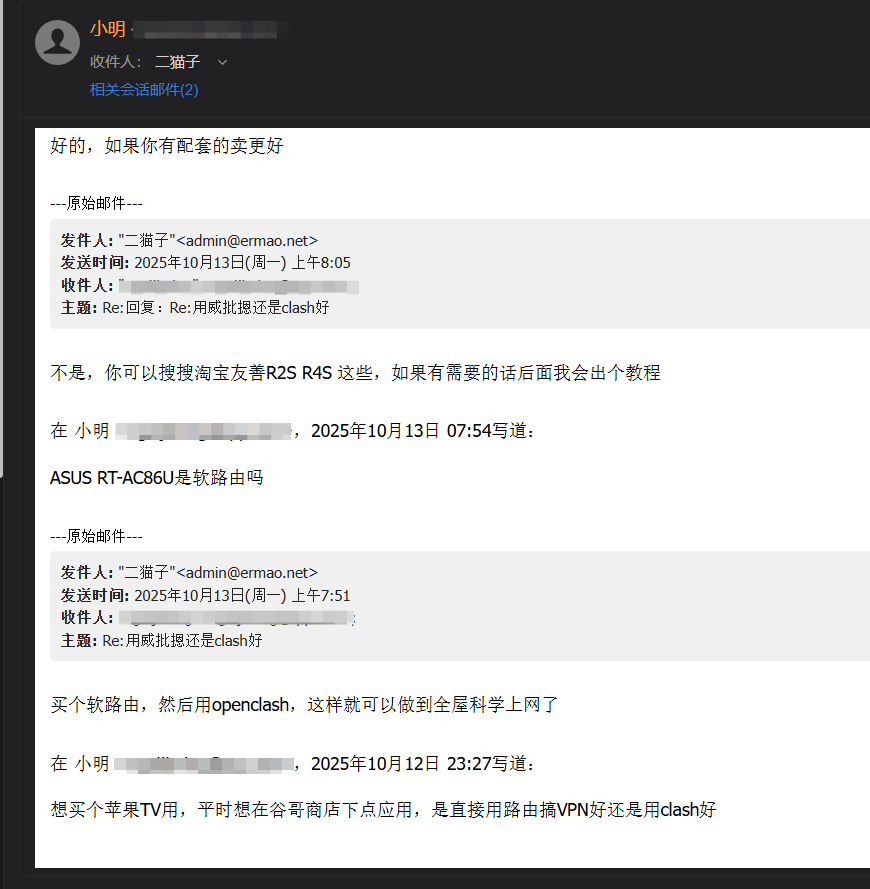
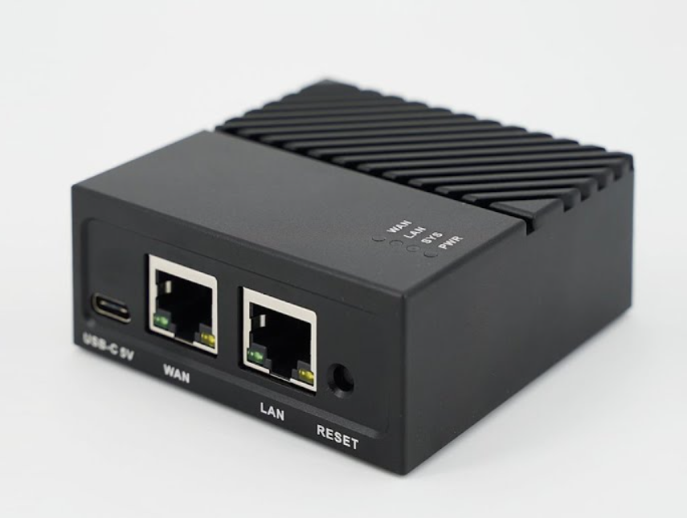

如果想要在家中所有设备（手机、电脑、智能电视等）都能自动翻墙，最省心的方式是**购买一台软路由**，然后在软路由上配置翻墙服务。这样，无论设备连接的是有线网络还是 WiFi，都能实现全屋翻墙。

但是我发现，很多人对软路由的概念比较模糊，甚至把软路由和翻墙机场搞混了。本文将详细介绍什么是软路由、软路由的优势、如何选择软路由，以及如何配置翻墙服务。

<!-- more -->

## 前言

上面对话是一名读者给我发的邮件，询问苹果TV翻墙的相关问题。以我经验来看，配置一个软路由让家里所有设备都能翻墙，才是最省心的方案。

但是接下来的对话让我意识到，很多人对软路由的概念比较模糊，从未接触过软路由，同时也不了解软路由跟硬路由的区别。

今天就接这个机会，来聊聊软路由的相关知识。顺便也向诸位读者表示，你们发邮件咨询问题我都很乐意解答，这也是我写作的动力之一。

## 什么是软路由？

软路由（Software Router）是一种基于软件实现的路由器功能的设备。它通常运行在通用硬件上，如PC、单板计算机（如Raspberry Pi）或专用软路由设备上。软路由通过安装特定的操作系统和路由软件，实现网络流量的管理和控制。

现在通常会用一台小型电脑（如Intel NUC、树莓派等）来充当软路由，安装专门的路由系统（如OpenWrt、pfSense、OPNsense等），然后通过配置这些系统来实现路由功能。这台软路由会接在家里的光猫后面（主路由模式），负责管理和分发网络流量。

新手不用研究乱七八糟的配置，直接某宝搜索“软路由”即可，价格大概在300-800元不等。但是要注意，买之前需要咨询卖家是否能 **刷入OpenWrt系统** 。其他系统例如 iKuai 安装翻墙软件比较麻烦，不建议新手尝试。

## 软路由的优势

1. **全屋翻墙**：软路由可以让家里所有连接到网络的设备（手机、电脑、智能电视等）都能自动翻墙，无需在每个设备上单独配置翻墙软件。

2. **集中管理**：通过软路由，可以集中管理网络流量，设置访问规则、限速等，提升网络使用体验。

3. **节省成本**：相比购买多个翻墙设备，软路由只需一台设备即可实现全屋翻墙，节省了硬件成本。

4. **灵活性**：软路由支持多种翻墙协议和服务，可以根据需求选择合适的翻墙方式。

5. **隐私保护**：通过软路由翻墙，可以隐藏所有设备的真实IP地址，提升上网隐私和安全性。

## 软路由首次使用

实际上买完软路由之后如何配置，卖家都会有详细的说明以及远程协助。只要按照说明一步步操作，通常都能成功。

这里就简单废话一下，供大家参考。

一下内容以R5S、openwrt系统、主路由模式为例。

1. **连接软路由**：将软路由通过网线连接到光猫的LAN口，然后用电脑连接到软路由的WiFi或LAN口。