## 9esim 使用指南：获取国外手机号注册海外账号

9esim 是一款便捷的 eSIM 服务，提供虚拟手机号，帮助用户轻松注册 Google、Telegram 等海外账号。本指南将详细介绍 9esim 的购买、激活与使用流程，适合新手快速上手。

<!-- more -->

## 为什么选择 9esim？

- ✅ **虚拟手机号**：无需实体 SIM 卡，随时获取国外号码
- ✅ **长期持有**：区别于临时接码服务，号码可长期使用
- ✅ **注册海外账号**：完美支持 Google、Telegram、Twitter 等平台
- ✅ **隐私保护**：避免使用真实手机号泄露个人信息
- ✅ **灵活使用**：支持一次性购买，按需激活

## 9esim 成本分析

| 项目 | 费用 | 说明 |
|------|------|------|
| 9esim v3 卡 | 21.6 美元 | 一次性购买，支持多次写卡 |
| eSIM Plus 应用 | 5.75 美元 | 虚拟手机号服务 |
| 总计 | 约 195 元人民币 | 比传统 SIM 卡更经济 |

9esim v3 卡原价是24美元，这里可以使用我的推广码 `ermao` 享受9折优惠，实付21.6美元。

> 💡 **提示**：相比其他服务商，9esim 提供高性价比的虚拟手机号解决方案。

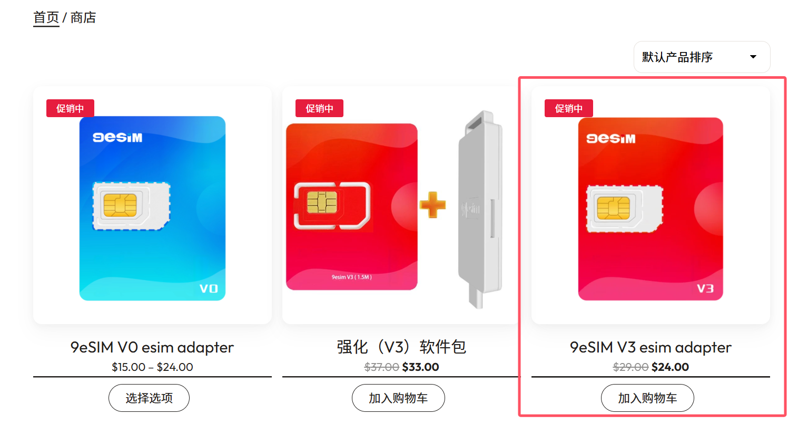

## 如何购买 9esim v3 卡

1. **访问官网**：前往 [9esim 官网](https://www.9esim.com/?coupon=ermao)，注册并登录账号。

2. **选择产品**：点击 "Buy now"。

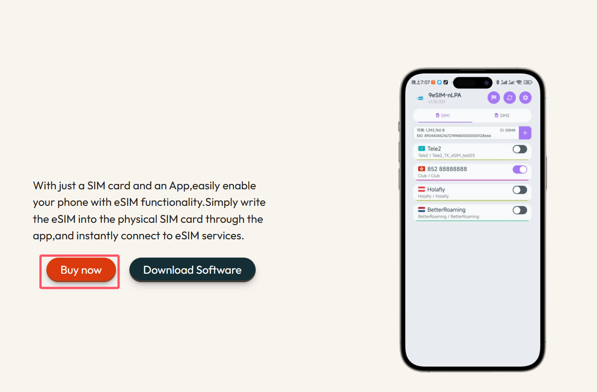

3. **添加购物车**：点击 "Add to basket"。

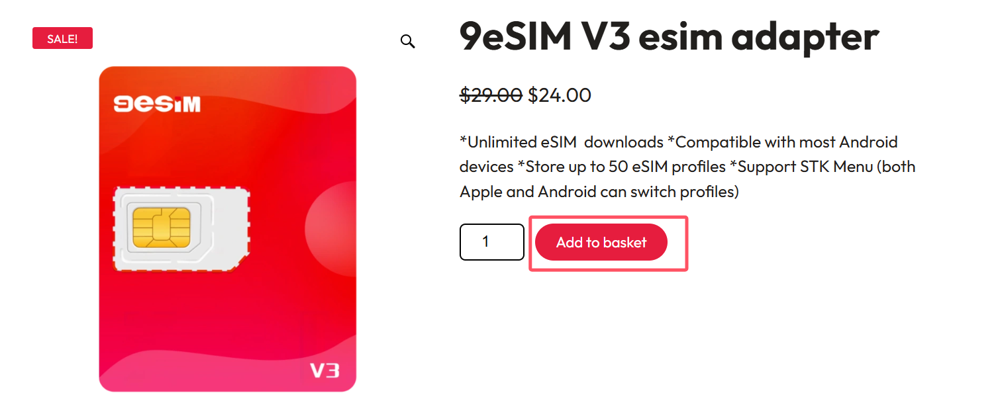

4. **结账**：点击 "Proceed to checkout"，填写收货信息，选择微信支付。如果没有优惠码的话，在付款前点击 "Add coupons" 输入 `ermao` 享受9折优惠。

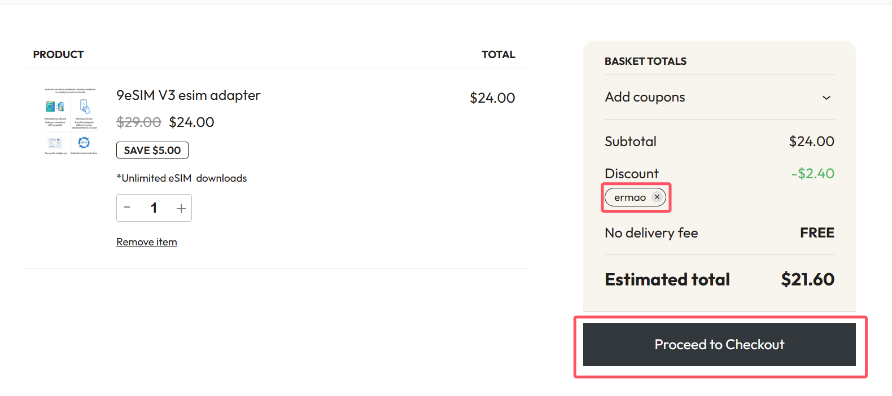

5. **完成付款**：确认订单，等待 3-5 天邮寄到家。

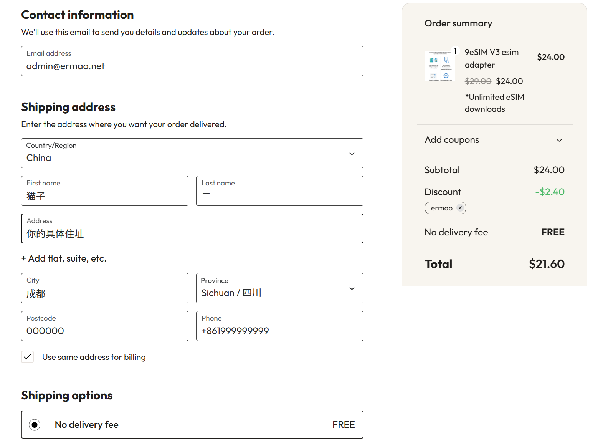

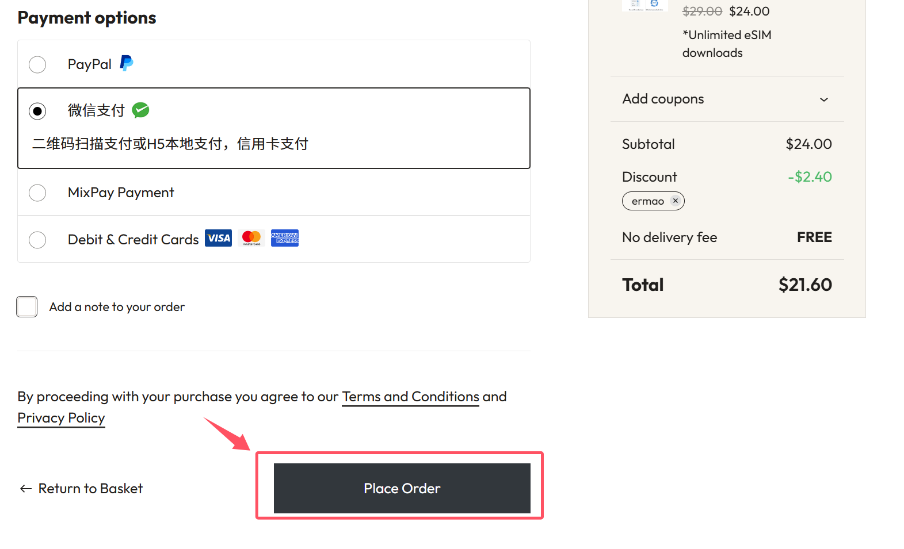

## 通过 eSIM Plus 应用购买虚拟手机号

1. **下载应用**：在 Google Play 搜索 "esim plus" 下载，或访问[官网下载](https://esimplus.onelink.me/WxwP/c7eggfvh)。

2. **注册登录**：首次使用点击注册，完成账号创建。

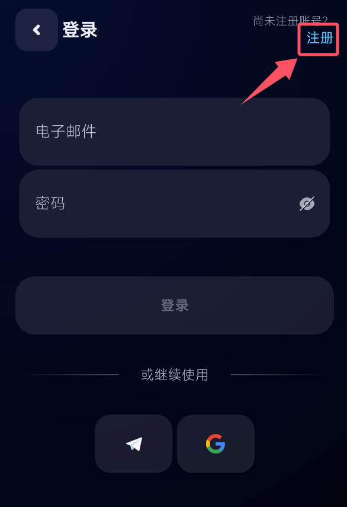

3. **添加 eSIM**：点击 "+" 选择 "移动数据" > "全球" > 按使用付费选项。

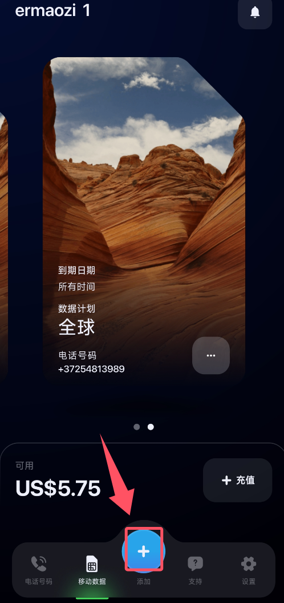

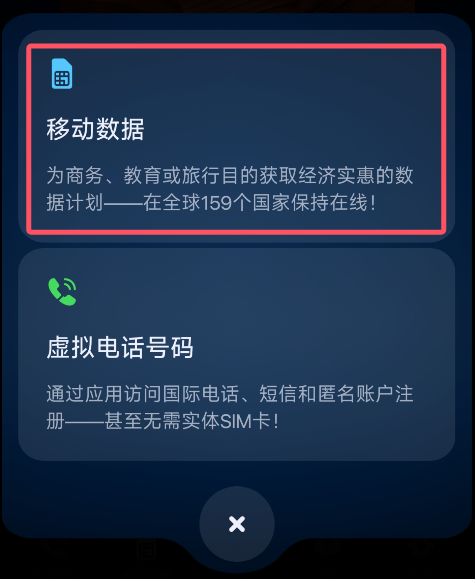

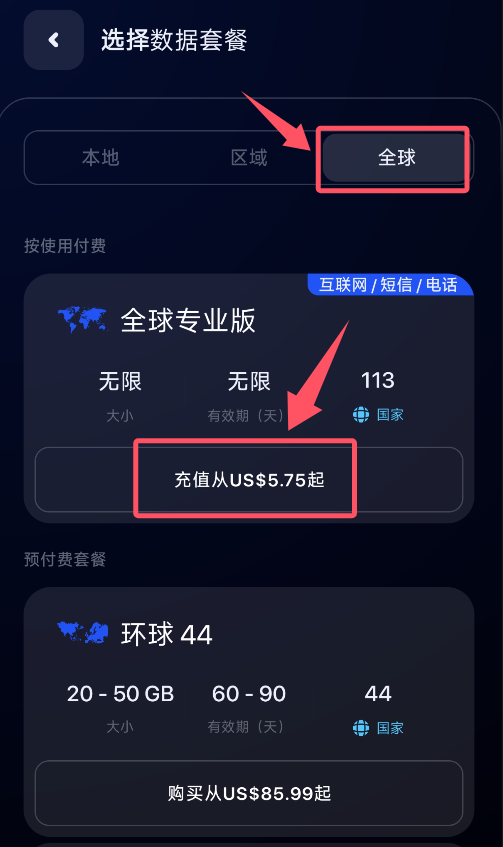

4. **购买计划**：选择 "一次性购买"，支持虚拟货币或 PayPal 支付。

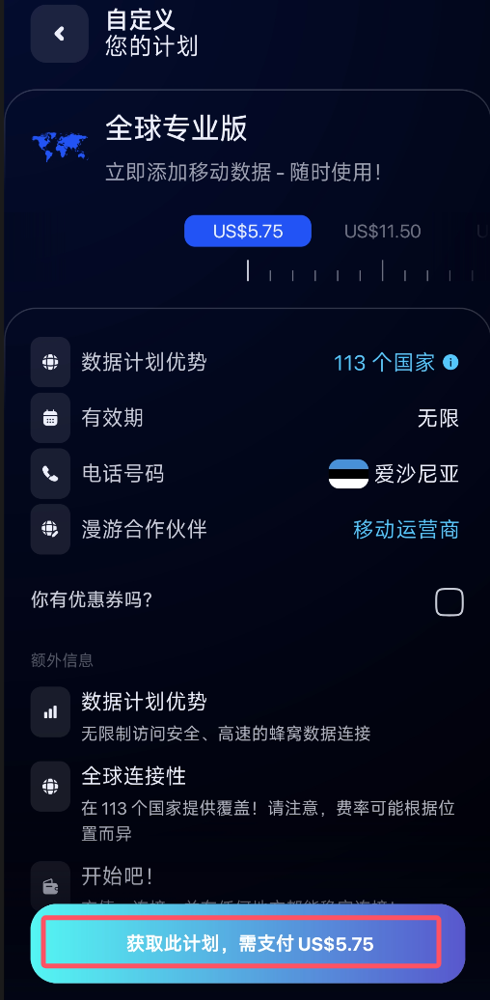

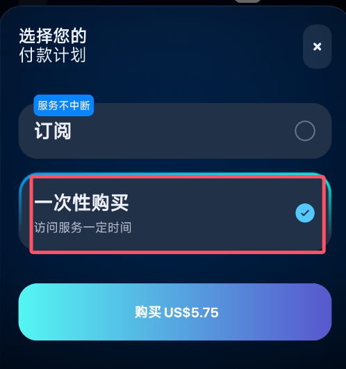

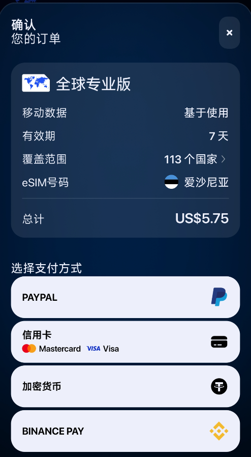

## 激活 eSIM：写卡教程

1. **安装物理卡**：收到 9esim v3 卡后，放入手机 SIM 卡槽。

2. **下载写卡应用**：访问 [9esim 应用下载页](https://www.9esim.com/ecosystem-software-download/)，下载对应系统的应用（如安卓的 9eSIM-nLPA）。

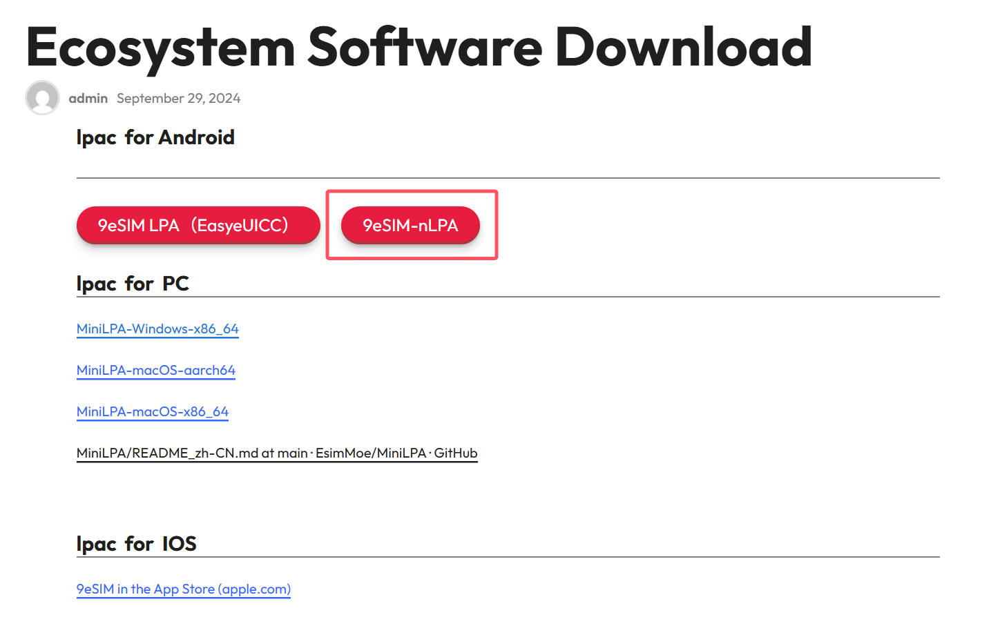

3. **生成二维码**：在 eSIM Plus 应用中选择购买的 eSIM，点击 "通过二维码" 保存图片。

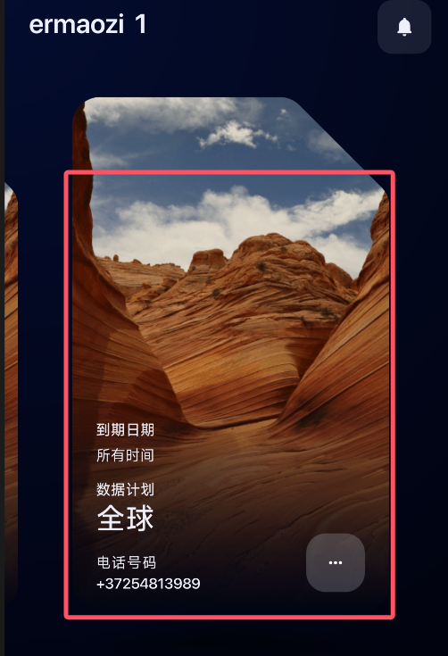

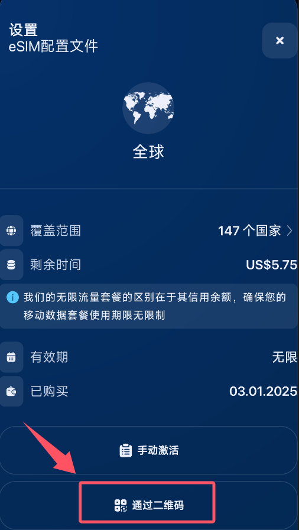

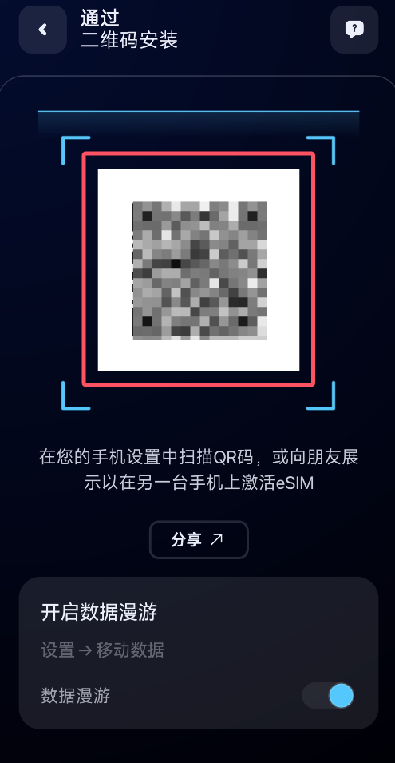

4. **写卡激活**：打开 9esim 应用，选择 SIM 卡槽，点击 "+" 上传二维码，确认下载。

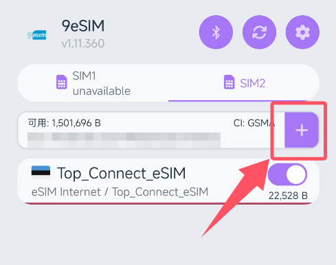

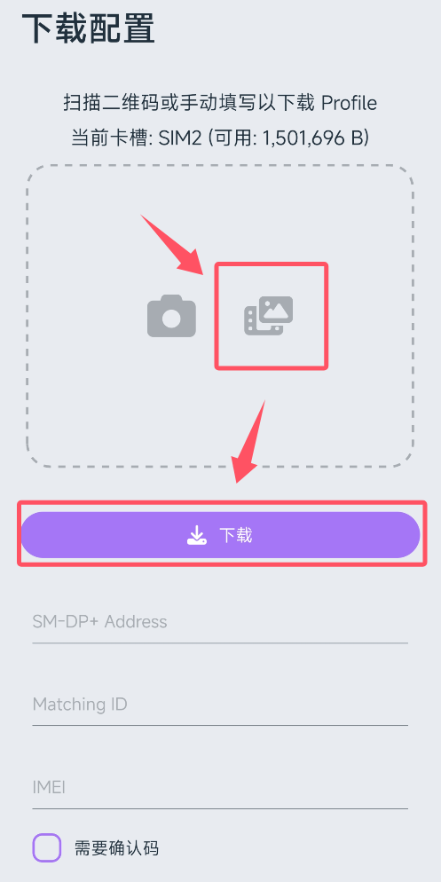

5. **完成激活**：等待写卡成功，即可使用虚拟手机号。

## 测试 9esim：注册 Google 账号

1. **访问 Google**：打开 [Google 账号管理](https://accounts.google.com/)，点击创建新账号。

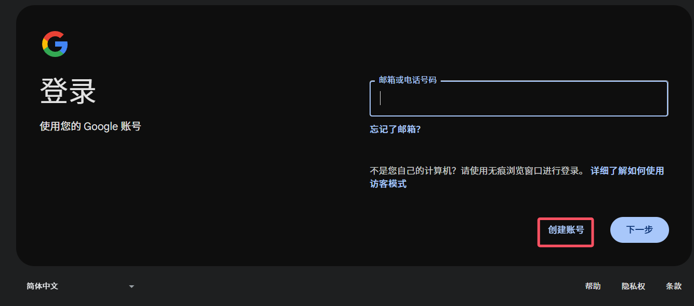

2. **输入手机号**：选择手机号验证，输入 9esim 提供的国外号码。

3. **接收验证码**：等待短信验证码，输入完成注册。

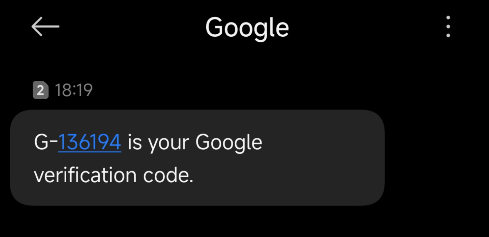

4. **验证成功**：如果收到验证码，说明 9esim 正常工作，可用于注册 Telegram、Twitter 等平台。

## 常见问题解答

**Q：9esim 支持哪些国家号码？**  
A：支持全球多个国家的虚拟手机号，适合注册海外服务。

**Q：eSIM 有效期多久？**  
A：一次性购买后，有效期内可无限使用。

**Q：如何更换号码？**  
A：在 eSIM Plus 应用中重新购买新计划。

**Q：安全吗？**  
A：9esim 使用加密技术，保护用户隐私。

## 相关推荐

- 📱 [Clash for Android 使用教程](https://www.ermao.net/article/eh8f4n86/)  
- 🖥️ [Clash for Windows 配置指南](https://www.ermao.net/article/0gematwc/)  
- 🌟 [2025 机场推荐汇总](https://www.ermao.net/posts/vpn/)

---

> 💡 **免责声明**：本文仅供技术学习参考，请遵守当地法律法规，合理使用虚拟手机号服务。

