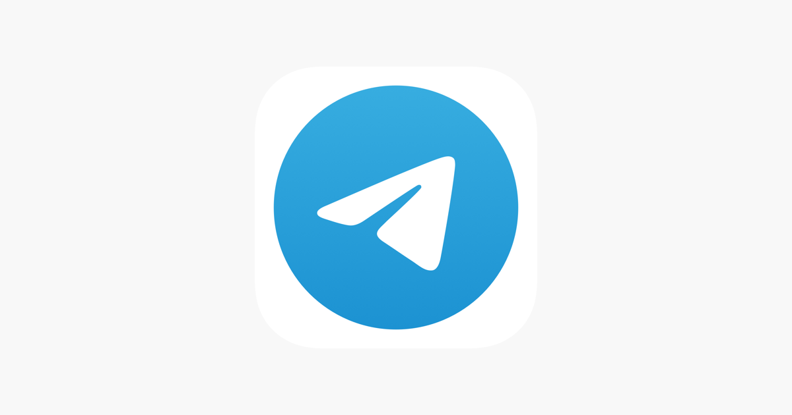
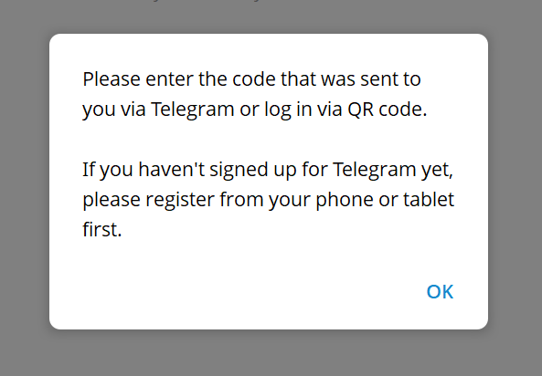
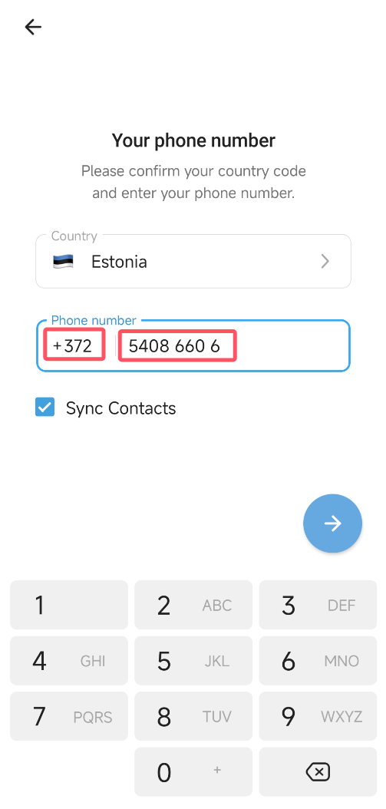
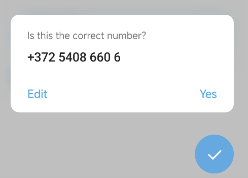
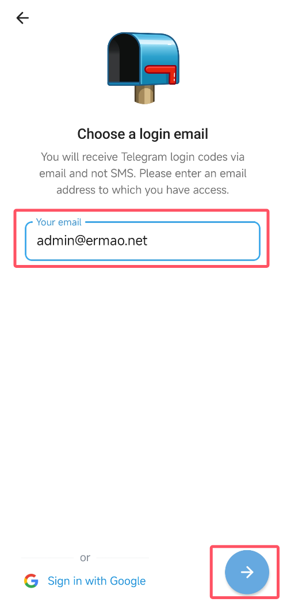
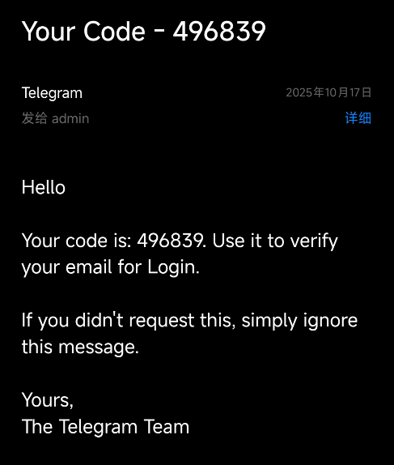
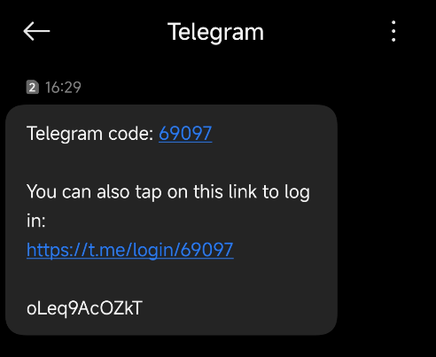
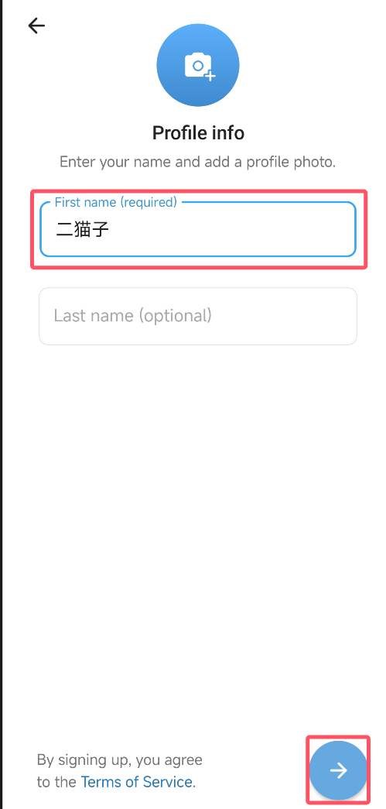
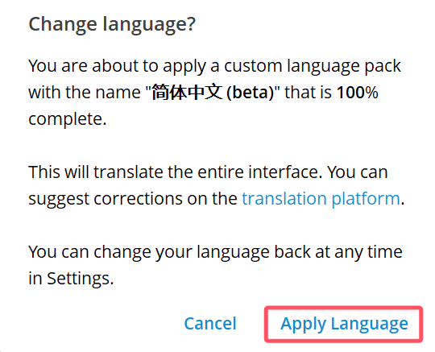
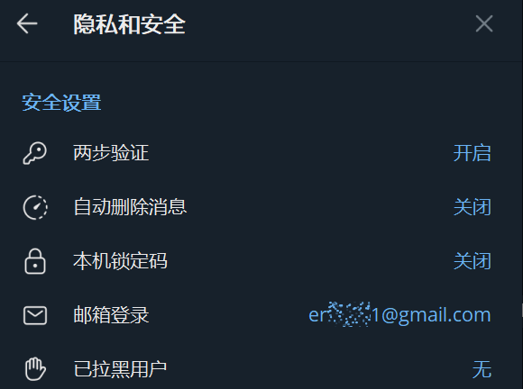

Telegram注册使用教程：本指南适合新手学习Telegram（电报、飞机）注册、隐私保护设置、群组频道创建和机器人使用。掌握跨平台同步、端到端加密聊天和高效沟通技巧，快速上手科学上网工具。

<!-- more -->

## Telegram是什么

Telegram 又名电报，也被称作“飞机”，是一款注重隐私保护和高效沟通的即时通讯应用。由俄罗斯企业家 Pavel Durov 于 2013 年创立，现由 Telegram FZ-LLC 公司运营，总部位于阿联酋迪拜。

Telegram以**Telegram隐私保护**、跨平台同步和高可用性著称。支持消息云端同步、端到端加密聊天、超大**Telegram群组**和频道、强大的**Telegram机器人**生态，以及大文件传输能力，非常适合个人和团队协作。

此外，Telegram对内容的限制较少，能有效避免因“违禁词”导致的沟通不畅，这也是许多用户选择它的重要原因。

## Telegram注册流程：步骤详解（以移动端为例）

### 步骤0：准备工作

由于Telegram首次注册必须在移动端完成，因此请先准备一台安装好客户端的手机。

同时，你需要一个能够接收短信或语音验证码的手机号（支持虚拟号码）。由于国内手机号（+86）可能无法收到验证码，建议使用港澳台或海外号码。

- 不清楚如何获取虚拟号码？参考：[9esim使用指南 - 获取国外手机号，注册Google、Telegram等账号](./9esim使用指南.md)
- 不了解如何访问Telegram？参考：[便宜好用的翻墙机场推荐评测](../机场推荐/vpn.md)

### 步骤1：下载与安装Telegram

- **移动端**：在App Store或Google Play搜索“Telegram”并安装。
- **桌面端**：访问官方页面[http://desktop.telegram.org](http://desktop.telegram.org) 下载Windows/macOS/Linux版本。
- **网页版**：访问[https://web.telegram.org](https://web.telegram.org)使用网页版（部分地区可能无法登录）。

### 步骤2：注册并登录Telegram账号

1. 打开Telegram应用，输入你的手机号码（从国家区号开始输入），点击“→”进入下一步。

2. 确认手机号码无误。

3. 输入你的邮箱地址。推荐使用Gmail，但国内邮箱也可以。

4. 此时，Telegram会向你的邮箱和手机号发送验证码，请分别输入以完成验证。

5. 设置你的名字和头像，完成注册。

6. 注册成功后可以点击这个链接完成汉化：[https://t.me/setlanguage/zh-hans-beta](https://t.me/setlanguage/zh-hans-beta)，移动端桌面端都可以使用。

### 步骤3：隐私与安全设置（强烈建议）

进入设置 → 隐私与安全：
- **两步验证**：设置独立密码（可加恢复邮箱），防止验证码被盗。
- **手机号可见范围**：仅联系人或仅自己。
- 控制最后上线时间、在线状态、头像、转发来源等。
- **设备管理**：在“设备”列表中可查看所有登录设备，建议定期清理陌生会话，一键登出其他设备。

## Telegram核心功能与使用技巧

### 1. Telegram群组与频道

- **群组（Group）**：适合讨论协作，支持主题、回复串、投票、文件共享，规模最高可达数十万人。
- **频道（Channel）**：单向广播，适合公告/媒体/社群发布，支持定时发送、草稿、多管理员分权与基础统计。

### 2. 秘密聊天（Secret Chat）

基于端到端加密，仅限单聊；消息可设定自动销毁，不走云端同步，**Telegram隐私保护**更高。

### 3. Telegram机器人（Bot）

通过@BotFather创建与管理机器人；可实现自动回复、表单收集、内容推送、群管等。消息下方添加Inline Keyboard（内联按钮）以引导操作或跳转链接。

### 4. 文件与多媒体传输

支持原图/原视频发送（不压缩）；单文件上限通常为2GB。历史消息与文件云端保存，跨设备随取随用。

### 5. Telegram日常效率技巧

- **内容搜索**：参考文章 [Telegram搜索机器人推荐——查找海量资源，提升信息检索效率](./tg搜索.md)
- **Saved Messages**：自我对话窗口，充当“云笔记/文件中转站”。
- **文件夹与存档**：按主题给会话分组；将不常用会话存档以保持清爽。
- **定时与静默发送**：长按“发送”可选择定时/静音投递。
- **消息撤回与编辑**：支持修改与撤回已发送的消息（但对方可能已保存副本）。

## Telegram常见问题（FAQ）

**Q1：没有手机号能用Telegram吗？**  
A：**Telegram注册**与登录必须使用手机号接收验证码。若不想使用私人号码，可另行申请合法的独立号码用于注册。

**Q2：Telegram与WhatsApp有什么区别？**  
A：Telegram在**隐私可控**、自定义程度、**机器人生态**与文件大小上限方面更灵活；频道/群规模也更大。

**Q3：Telegram消息能否跨设备同步？**  
A：可以。手机、电脑可同时在线，消息在云端同步；但“秘密聊天”除外，其内容仅保存在本地设备。

**Q4：Telegram网页端为什么登录不了？**  
A：部分地区或账号可能因策略限制无法登录网页版。建议使用官方桌面客户端。

**Q5：为什么我的新号容易受限？**  
A：为防止垃圾信息，系统会对新账号的加群、私聊等行为进行限制。建议完善个人资料、减缓操作频率，并通过邀请链接加入群组以降低风险。如被限制，可联系官方机器人 @SpamBot 了解原因与解除时长。

## Telegram安全使用指南

- **开启两步验证**：为你的账号设置一个独立的密码（App Passcode），这是最重要的安全防线。
- **管理设备列表**：定期检查在线设备，及时清理陌生或不再使用的会话。
- **善用秘密聊天**：在讨论敏感内容时，优先使用端到端加密的秘密聊天功能，并设置消息自动销毁。
- **遵守社区规则**：避免骚扰式加群或群发广告，遵守平台规则与当地法律政策。

## 最后

有任何问题欢迎在评论区留言，或通过邮件联系我：[admin@ermao.net](mailto:admin@ermao.net)。

我很乐意在能力范围内为大家提供帮助，这是我创作的动力，也是我的兴趣所在。

