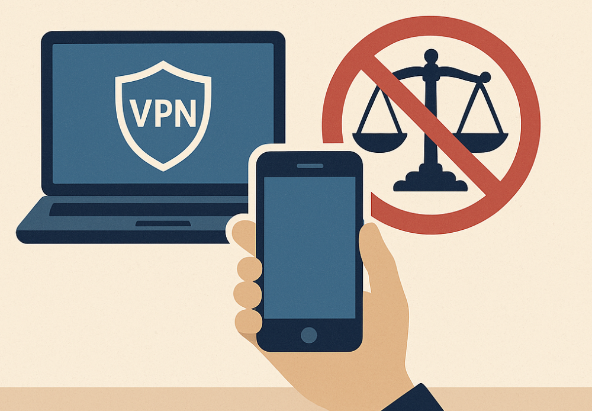

**国内法规重点打击私自搭建和经营 VPN，普通用户购买正规服务自用一般不被认定违法。**

本文解析在中国购买 VPN 的法律界限，阐明“私自搭建违法、普通购买通常不违法”的逻辑，并给出合规使用建议。

<!-- more -->

## 国内购买 VPN 是否违法？

在中国境内，法律重点规范的是 **私自搭建、出租或经营 VPN（跨境专线）** 等行为；普通个人仅为自用而购买第三方服务，通常**不会被认定为违法**，更谈不上犯罪。当然，若购买后从事违法活动，仍可能触及行政或刑事责任。

## 法律依据与监管重点

### 《计算机信息网络国际联网管理暂行规定（2024 修订）》第六条
> 计算机信息网络直接进行国际联网，必须使用国家公用电信网提供的国际出入口信道。任何单位和个人不得自行建立或者使用其他信道进行国际联网。

**解读**：条文剑指“自行建立或使用其他信道”进行国际联网，即未经审批擅自搭建、运营跨境链路的行为。

### 《计算机信息网络国际联网管理暂行规定（2024 修订）》第十四条
> 违反本规定第六条、第八条和第十条的规定的，由公安机关责令停止联网，给予警告，可以并处 15000 元以下的罚款；有违法所得的，没收违法所得。

**监管现实：**
- 🚫 **严格查处对象**：私建 VPN、转售账号、提供跨境通信业务的个人或企业。
- ✅ **普通购买者**：法律并未明文禁止，仅要求通过合法信道；实践中多以宣传提醒为主，很少对单纯购买者处罚。
- ⚠️ **违法加重情形**：利用 VPN 实施诈骗、危害国家安全等活动，将依据相关刑法另行追责。

## 为什么说“搭建违法、购买不违法”？

| 情形 | 法律定位 | 说明 |
|------|----------|------|
| 私自搭建 VPN、出售账号 | 行政违法（情节严重可触刑法） | 未经批准提供国际联网服务，典型处罚案例多集中于此 |
| 企业擅自架设专线 | 行政违法 | 需向工信部门申请专线或 VPN 审批 |
| 个人购买第三方 VPN 自用 | 通常不认定违法 | 无经营行为，监管以劝导为主；仍应确保来源合规 |
| 个人借 VPN 从事违法犯罪 | 触及刑法 | 依据具体行为定性，与 VPN 本身无直接关联 |

> 📌 **总结**：法规针对的是“信道建设与运营”。消费者购买服务不存在“自行建立”问题，原则上不违反该条款。

## 行政风险与合规提醒

1. **选择正规服务商**：优先选择有备案、获批的跨境通信产品（如运营商国际精品网）。
2. **避免倒卖账号**：转售或分享收费订阅，可能被认定为非经营性使用转为经营活动。
3. **审慎使用**：即便购买合法服务，也需遵守网络安全、数据安全等更高层级法规。
4. **留存凭证**：与服务商签署的协议、付款记录，可在遇到检查时证明自用性质。

## 常见问题速答（加量版）

**Q：仅仅为了访问外网资讯而购买 VPN，会被处罚吗？**
A：通常不会。监管重点在非法搭建和牟利经营，普通自用用户大概率只会收到提醒。

**Q：公司给员工统一购买 VPN 会违法吗？**
A：企业若批量购买用于办公需确保服务商持有合法资质；否则建议向运营商申请合规专线。

**Q：为什么有报道说有人因 VPN 被罚？**
A：多数案例是“非法运营”“倒卖账号”或“搭建私服”，而非单纯购买使用。

**Q：如何判断 VPN 服务合规？**
A：查看是否由基础电信运营商或持牌增值电信业务提供；正规服务通常有明确合同与备案信息。

## 合规使用建议

- 使用前确认需求，如远程办公、学术访问等合法用途。
- 对于企业或团队用户，优先走工信部审批流程申请专线。
- 保持良好上网习惯，不传播违法信息、不参与违法活动。
- 若需更高合规性，可咨询律师或当地工信主管部门。

## 案例参考

- **案例 1：某地查处个人架设 VPN 出租**
  - 行为：搭建节点、售卖账号。
  - 结果：没收设备，罚款并行政拘留。
  - 启示：经营性行为风险极高。

- **案例 2：企业未经审批自建国际专线**
  - 行为：为跨境业务自行搭建线路。
  - 结果：被责令停用并罚款。
  - 启示：企业必须走审批流程。

- **案例 3：消费者购买境外 VPN 自用**
  - 行为：仅为查看资料，无经营行为。
  - 结果：多地未见处罚案例。
  - 启示：普通消费者风险极低，但需理性判断服务合法性。

## 总结

- ✅ **搭建与转售**：未经批准即违法，务必避免。
- ✅ **个人购买自用**：通常不被认定违法，现实中监管宽松。
- ✅ **合规底线**：保持合法用途、选择正规渠道、遵守网络安全法规。
- ✅ **风险意识**：了解法律边界，必要时咨询专业律师获取权威意见。

> **提示**：本文为信息整理，不构成法律意见。实际情况以最新政策和主管部门解释为准，请在合法合规框架内使用相关服务。
