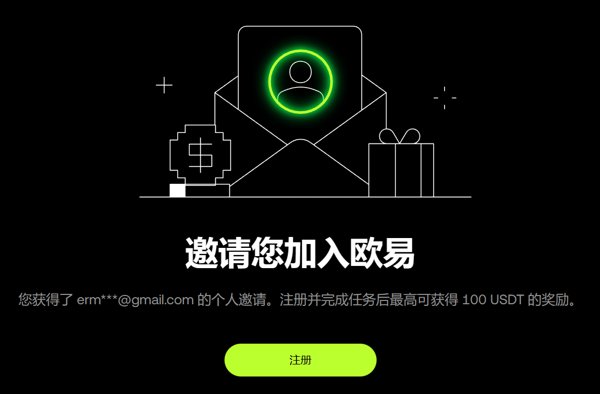
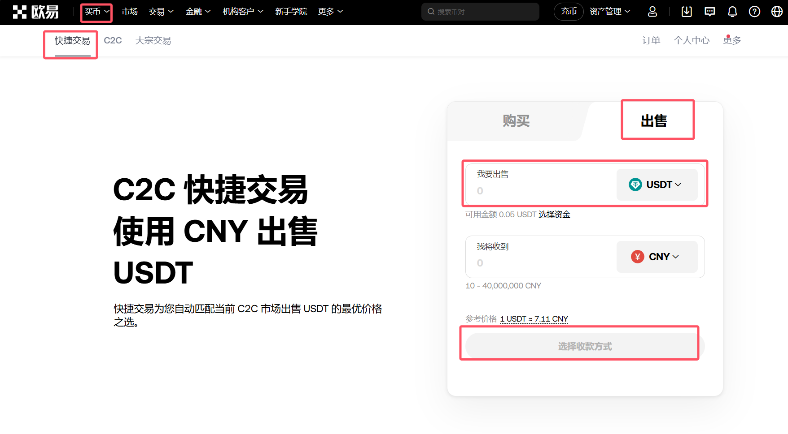

想快速掌握 OKX 注册流程、USDT 充值、虚拟币转账与提现到支付宝 / 微信 / 银行卡的完整步骤？本文结合实操截图、手续费解析和安全提示，为零基础新手提供一站式虚拟币入门攻略。
<!-- more -->

## 文章导读
- [注册 OKX 账号（新手指南）](#step1)
- [充值虚拟币（接收 USDT / BTC 等资产）](#step2)
- [发送虚拟币（对外转账与手续费策略）](#step3)
- [提现虚拟币到法币账户（支付宝 / 微信 / 银行卡）](#step4)
- [常见新手问题与解答（FAQ）](#faq)
- [行动建议与延伸阅读](#action)

## 虚拟币入门：以OKX为例的使用方法介绍

> 只有能够通过虚拟币完成交易，虚拟币才有价值。

这一章节我们先解决实际问题：如何接收[虚拟币](#虚拟币)、如何发送虚拟币、如何提现虚拟币到法币账户等。

这里我们以 [OKX（欧易）](https://www.gtohfmmy.com/join/95824812)交易所为例，介绍虚拟币的基础使用方法。

### 1. 注册 OKX 账号（新手指南）
开始前，准备好常用邮箱或手机号，并确保网络环境稳定，以便顺利完成短信或邮件验证。

[OKX](https://www.gtohfmmy.com/join/95824812) 目前在国内无法直接注册，需要使用国际版网站（[okx.com](https://www.gtohfmmy.com/join/95824812)）或 App。

如果你无法访问，可以使用翻墙工具访问。参考文章：[便宜好用的翻墙机场推荐评测(长期更新 欢迎推荐)](https://www.ermao.net/posts/vpn/)

OKX（欧易）官网地址：[https://www.gtohfmmy.com/join/95824812](https://www.gtohfmmy.com/join/95824812)

注册时请使用邮箱或手机号，设置强密码，并开启两步验证（2FA）以提升账号安全性。

### 2. 充值虚拟币（接收 USDT / BTC 等资产）
**关键词提示：** OKX 充值地址、USDT TRC20 手续费、链上到账时间。

简单来说就是两个步骤：1、创建账户与钱包。 2、获取充值地址并转账。

当你通过各种方式获取佣金，但佣金需要通过虚拟币结算时，你就需要一个虚拟币地址来接收这些虚拟币。

在 [OKX](https://www.gtohfmmy.com/join/95824812) 首页就有一个非常明显的“充值数字货币按钮”。

现在大多数平台结算佣金都会使用 USDT（泰达币），因为它是稳定币，价格波动小。网络通常选择 TRC20（波场链），因为手续费低。

当然也有平台建议使用 bnbc（币安智能链）,我的建议是暂时不要接受建议，因为 bnbc 虽然手续费更低，但是目前在国内交易所支持度不高，提现麻烦。

下面得到的地址就是你的 USDT-TRC20 地址，你可以把它提供给需要给你打款的平台。

当收到虚拟币后，你可以在“资产管理-我的资产”中看到对应的余额。

> 附：[翻墙后如何利用信息差赚点外快](https://www.ermao.net/article/rsvptr5x/)

### 3. 发送虚拟币（对外转账与手续费策略）
在填写对方地址前，先核对网络类型与地址格式，必要时可先小额试转，降低操作失误风险。

发送虚拟币就很简单了，在“资产管理-提币”页面中，选择你要发送的币种（比如 USDT），然后填写对方的地址和数量即可。

要注意的是，虚拟币一旦发送将无法撤回，所以一定要确认地址与网络类型是否正确。

**切记，虚拟币交易不受法律保护，请务必谨慎操作。**

### 4. 提现虚拟币到法币账户（支付宝 / 微信 / 银行卡）
通过 C2C 频道提前筛选高评分商家，关注汇率、付款时限以及是否支持你常用的收款方式。

当你需要把虚拟币提现到法币账户时，可以通过 OKX 的 C2C 交易功能实现。

交易所中的 C2C 功能允许用户之间直接买卖虚拟币，你可以选择卖出 USDT，然后选择支付宝、微信或银行卡等方式收款。

交易前需要实名认证，并绑定相应的支付方式。

**交易时请牢记以下几点：**

1. 交易方式尽量 **不要选择银行卡**，因为银行对虚拟币交易的态度比较严格，可能会导致资金被冻结。

2. 每日交易尽量 **不要超过5万元人民币**，以免引起收款平台风控。

3. 年收款总额 **不要超过50万元人民币**，收入过高时收款平台会将交易数据推送至税务平台，若忘记缴税将会承担税务风险。

4. 交易时务必仔细确认付款人姓名是否与 OKX 账户实名认证姓名一致，否则可能会导致交易失败或资金损失，甚至可能收到黑钱。

#### 风险控制小结
- 优先选择实名认证且评价稳定的商家，保留聊天与收款凭证以备查验。
- 开启提现白名单和两步验证，防止账号被盗或误操作。

## 名词解释

### 虚拟币
- **是什么：** 依托区块链发行与流通的数字化资产。
- **为什么重要：** 支撑跨境转账、链上应用与数字经济。
- **新手要点：** 先接触主流币种（BTC、ETH、USDT），了解价格波动与安全存储。

### 冷钱包
- **是什么：** 不联网保存私钥的硬件设备或纸质钱包。
- **为什么重要：** 远离黑客风险，适合长期持有大额资产。
- **新手要点：** 初期可观察使用流程，再考虑购买品牌硬件钱包。

### Web3
- **是什么：** 让用户拥有数据与资产的“读+写+拥有”互联网形态。
- **组合结构：** 钱包（MetaMask）、公链（以太坊）、协议（DeFi/DAO）、应用（链游、社交）。
- **新手要点：** 从熟悉钱包签名、链上转账开始，逐步了解更多协议。

### USDT
- **是什么：** 与美元 1:1 锚定的稳定币，由 Tether 公司发行。
- **常见用途：** 交易所计价、链上资金周转、对冲市场波动。
- **新手要点：** 关注发行方审计报告，不要误以为等同银行存款。

### TRC20
- **是什么：** 波场链上的代币标准，类似以太坊的 ERC20。
- **优势：** 手续费低、确认快、被 CEX 广泛支持。
- **新手要点：** 充值/提现前确认收款地址支持 TRC20，必要时先小额测试。

### 交易所类型：CEX vs DEX
快速对比有助于选对入门渠道：先从 CEX 了解基础，再逐步尝试 DEX 的自主管理。

| 对比项 | CEX（中心化交易所） | DEX（去中心化交易所） |
|--------|---------------------|------------------------|
| 资产托管 | 平台托管 | 用户自管（钱包签名） |
| 体验速度 | 一般更快 | 依赖链性能 |
| 法币入口 | 支持（OTC、充值） | 通常不直接支持 |
| 手续费 | 牌价与分层费率 | 由合约+流动性池+Gas 组成 |
| 风险点 | 平台安全、托管风险 | 私钥管理、合约漏洞 |
| 适合人群 | 初学者、法币兑换 | 熟悉链操作的进阶用户 |

常见 CEX：OKX（欧易）、Binance（币安）、Coinbase。常见 DEX：Uniswap、Curve、Raydium、PancakeSwap。

### OKX

OKX（欧易）官网地址：[https://www.gtohfmmy.com/join/95824812](https://www.gtohfmmy.com/join/95824812)

OKX 是全球化的加密资产交易平台，提供：
- 现货交易、法币购买、合约（永续/交割合约）、杠杆、质押（Earn）、Web3 钱包。
- 多链资产管理与跨链转移支持。
优势点：产品线完整、接口友好、深度较好、风险控制工具（止盈止损、跟踪委托）。
风险提示：合约杠杆高风险；请了解标的与仓位管理，不盲目满仓。

### 基础术语速览
| 术语 | 简释 |
|------|------|
| 公链 | 开放账户与合约的区块链（ETH、Solana） |
| Gas | 链上执行交易的费用 |
| 稳定币 | 与法币锚定，减少波动（USDT、USDC） |
| 私钥 | 资产所有权核心，遗失则无法找回 |
| 托管风险 | 平台被攻击或内部问题导致资产冻结 |
| 滑点 | 实际成交价与预期价差异 |
| 永续合约 | 无到期日的合约，靠资金费率平衡多空 |
| 资金费率 | 多空持仓周期性结算的费用 |

## 虚拟币交易风险与合规提醒
- 价格剧烈波动：仅投入可承受损失的资金。
- 保管私钥：若使用链上钱包，务必离线备份助记词。
- 识别钓鱼：警惕仿冒网址、假空投、社交诱导。
- 分辨项目质量：多看白皮书、代码审计、社区活跃度。
- 避免高杠杆：强平风险高，初学者不建议超 3×。
- 法规差异：不同地区监管要求不同，请遵守所在地法律政策。

## 快速入门建议
- 第一周：只做现货小额买入与卖出，熟悉界面。
- 第二周：学习链上钱包与转账（少额测试）。
- 第三周：研究稳定币与资产分配（现货 / 备用 USDT）。
- 后续：再逐步了解合约、质押、跨链与 DeFi。

## 常见新手问题
**Q: USDT 网络选错怎么办？**
可能无法到账或需人工找回，充值前务必确认网络类型与地址格式。

**Q: 要不要全仓买热门币？**
不建议。可分批建仓，设置预期区间与止损策略。

**Q: 钱包和交易所哪个更安全？**
自管钱包掌握私钥更自主，但操作失误风险高；交易所便捷但有托管风险。

**Q: 为什么提现要审核？**
风控与合规需要，防止盗号与异常行为。

## 行动建议与延伸阅读
- 立即前往 [OKX 官网](https://www.gtohfmmy.com/join/95824812) 完成注册与 KYC，领取新手福利任务。
- 阅读《[便宜好用的翻墙机场推荐评测(长期更新 欢迎推荐)](https://www.ermao.net/posts/vpn/)》确保访问渠道稳定。
- 收藏本文，按章节逐步完成账号创建、充值、转账与提现全流程。

## 总结
虚拟币世界包含资产、协议、基础设施与金融逻辑；OKX 为入门级与中级用户提供了集中化界面与多功能工具。稳步学习、控制风险、循序渐进是长期留存与提升认知的关键。

> 免责声明：本文为基础概念与操作指引，不构成投资建议。请根据自身风险承受能力独立判断并遵守当地法律法规。
