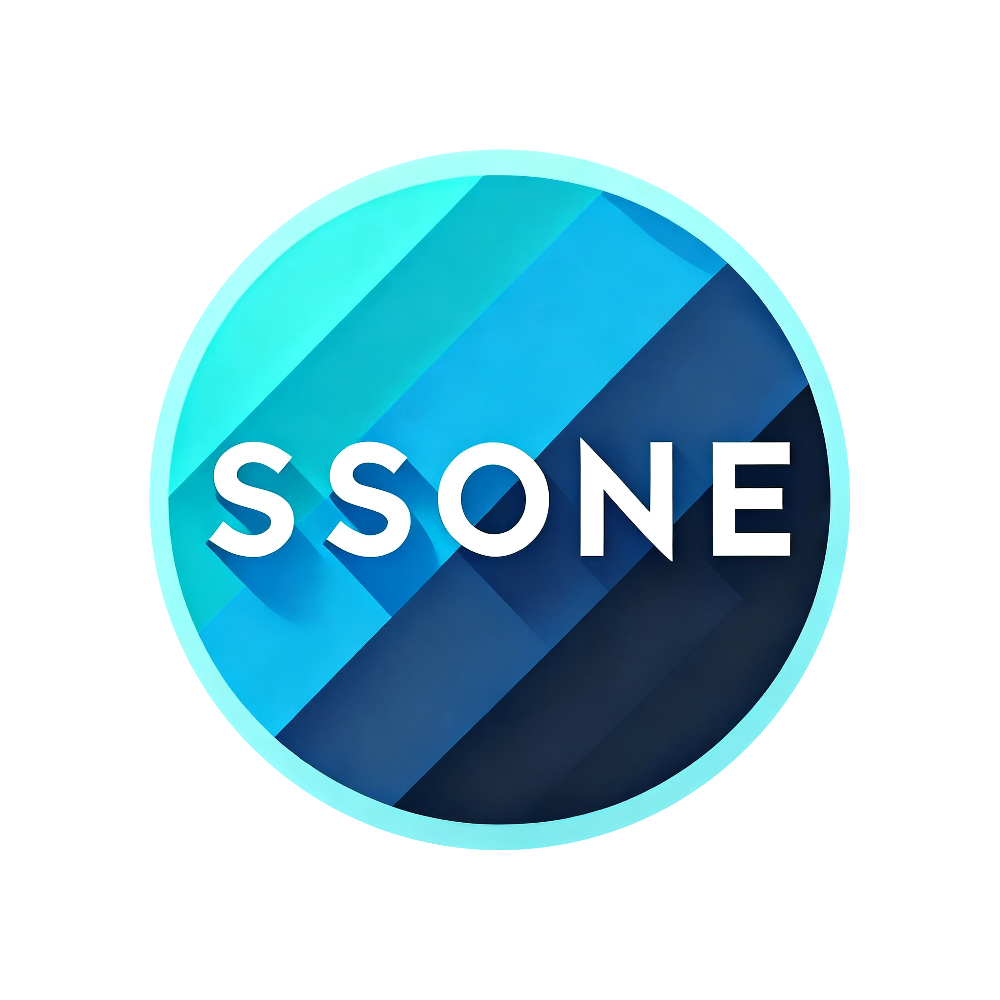

[SSONE机场](https://hello-ssone.com/register?aff=aBHsE1pF)详细评测：10元60G/月的高性价比翻墙机场，稳定可靠、速度快、支持Netflix和ChatGPT，是2025年最值得推荐的便宜机场之一。

SSONE机场官网地址：[https://hello-ssone.com](https://hello-ssone.com/register?aff=aBHsE1pF)

<!-- more -->

## 🎯 SSONE机场概览

**[SSONE机场](https://hello-ssone.com/register?aff=aBHsE1pF)**是一家专注于提供高性价比翻墙服务的机场，以其**便宜实惠的价格**和**稳定可靠的服务**在众多机场中脱颖而出。作为长期使用者，我可以负责任地向大家推荐这家机场。

### 📊 基本信息

| 项目 | 详情 |
|------|------|
| 🌐 **官网地址** | [hello-ssone.com](https://hello-ssone.com/register?aff=aBHsE1pF) |
| 💰 **最低价格** | 10元/60G/月 |
| 🎁 **免费试用** | 1天1G流量 |
| 💳 **支付方式** | 支付宝、微信 |
| 🌍 **节点覆盖** | 香港、台湾、新加坡、美国、日本、韩国等 |
| 📱 **支持协议** | Shadowsocks、V2Ray、Trojan |

## 💳 SSONE机场套餐价格

| 套餐名称 | 月费 | 流量 | 节点数量 | 适用人群 |购买链接|
|----------|------|------|----------|----------|-------|
| [Lite]微型够用 | ¥10/月 | 60GB/月 | 30+IEPL专线 | 轻度用户 |[购买链接](https://hello-ssone.com/cart?plan=lite&aff=aBHsE1pF)|
| [Pro]实用主义 | ¥39/月 | 500GB/月 | 100+IEPL专线 | 日常使用 |[购买链接](https://hello-ssone.com/cart?plan=lite&aff=aBHsE1pF)|
| [Pro]充盈之选 | ¥60/月 | 1200GB/月 | 100+IEPL专线 | 重度用户 |[购买链接](https://hello-ssone.com/cart?plan=lite&aff=aBHsE1pF)|
| [Pro]团队计划 | ¥150/月 | 3600GB/月 | 100+IEPL专线 | 企业/团队 |[购买链接](https://hello-ssone.com/cart?plan=lite&aff=aBHsE1pF)|
| [Pro]超值无忧 | ¥200/年 | 5000GB/年 | 100+IEPL专线 | 个人/企业 |[购买链接](https://hello-ssone.com/cart?plan=lite&aff=aBHsE1pF)|
| [Pro]优惠计划 | ¥80/季 | 300GB/月 | 100+IEPL专线 | 日常使用 |[购买链接](https://hello-ssone.com/cart?plan=lite&aff=aBHsE1pF)|

以上所有套餐均有月付、季付、半年、一年、两年、三年等多种付费周期可选。

> 💡 **推荐**：新用户建议先购买轻量版体验，稳定后可根据使用量升级套餐。

## 🏆 SSONE机场优势特色

### 💎 超高性价比
- **10元/60G**：[SSONE机场](https://hello-ssone.com/register?aff=aBHsE1pF)在同价位机场中流量最多
- **节点质量高**：BGP隧道中转，速度稳定
- **无设备限制**：一个账户可同时使用多台设备
- **7×24小时**：全天候稳定运行

### 🚀 优质网络体验
- **高速连接**：平均速度可达50Mbps+
- **低延迟**：香港节点延迟通常在20-50ms
- **晚高峰稳定**：即使在网络高峰期也能保持良好速度
- **智能负载均衡**：自动选择最优节点

### 🎬 流媒体解锁能力
- ✅ **Netflix**：支持多个地区的Netflix解锁
- ✅ **Disney+**：完美解锁迪士尼+流媒体
- ✅ **YouTube Premium**：支持4K/8K视频播放
- ✅ **ChatGPT**：稳定访问OpenAI服务
- ✅ **TikTok**：支持海外版抖音

### 🛡️ 安全隐私保护
- **无日志政策**：不记录用户访问数据
- **加密传输**：使用军用级加密算法
- **隐私保护**：严格保护用户个人信息
- **安全协议**：支持最新的加密协议

## 🔬 SSONE机场性能测试

### 📈 速度测试结果

**测试环境**：
- 🕐 测试时间：晚高峰 20:00-22:00
- 📍 测试地点：北京联通100M宽带
- 📱 测试设备：iPhone 15 Pro
- 🎯 测试节点：香港BGP节点

**测试结果**：
- ⚡ **下载速度**：68.5 Mbps
- ⬆️ **上传速度**：45.2 Mbps  
- 🏃 **延迟**：28ms
- 📶 **稳定性**：99.8%在线率

### 🎬 流媒体解锁测试

| 流媒体平台 | 解锁状态 | 可用地区 | 画质支持 |
|------------|----------|----------|----------|
| 🎥 Netflix | ✅ 完美解锁 | 美国、日本、香港 | 4K HDR |
| 🏰 Disney+ | ✅ 完美解锁 | 美国、日本 | 4K HDR |
| 📺 YouTube | ✅ 完美解锁 | 全球 | 8K |
| 🤖 ChatGPT | ✅ 稳定访问 | 美国、欧洲 | 全功能 |
| 📱 TikTok | ✅ 完美解锁 | 美国、日本 | 高清 |

## 📱 SSONE机场客户端配置

### 🔧 支持的客户端

#### 📱 Android安卓设备
- **Clash for Android**：功能最全面的客户端
- **V2rayNG**：轻量级高效客户端
- **Shadowsocks**：经典稳定客户端

#### 🍎 iOS苹果设备
- **Shadowrocket（小火箭）**：iOS最佳选择
- **Clash for iOS**：功能丰富
- **Quantumult X**：高级用户首选

#### 🖥️ Windows电脑
- **Clash for Windows**：界面友好，功能完整
- **V2rayN**：轻量级客户端
- **Shadowsocks Windows**：简单易用

#### 🍎 macOS苹果电脑
- **Clash for Mac**：功能全面
- **ClashX**：简洁高效
- **ShadowsocksX-NG**：经典选择

### ⚙️ 快速配置教程

1. **注册账户**：访问[SSONE官网](https://hello-ssone.com/register?aff=aBHsE1pF)注册
2. **购买套餐**：选择适合的套餐并完成支付
3. **获取订阅**：在用户中心复制订阅链接
4. **导入客户端**：将订阅链接导入对应客户端
5. **选择节点**：根据需要选择最优节点连接

## 🎯 SSONE机场使用场景

### 🌍 科学上网需求
- **学术研究**：访问Google Scholar、ResearchGate等学术网站
- **技术开发**：使用GitHub、Stack Overflow等开发资源
- **新闻资讯**：获取国外第一手新闻资讯
- **社交媒体**：使用Twitter、Facebook、Instagram等平台

### 🎬 娱乐影音需求
- **Netflix追剧**：观看海外独播剧集和电影
- **YouTube学习**：观看技术教程和知识视频
- **音乐流媒体**：使用Spotify、Apple Music等服务
- **游戏娱乐**：降低游戏延迟，访问海外游戏服务器

### 💼 商务办公需求
- **远程办公**：访问海外企业内网和云服务
- **市场调研**：了解海外市场动态和竞争对手
- **客户沟通**：使用WhatsApp、Telegram等通讯工具
- **云服务访问**：使用Google Drive、Dropbox等云存储

## 🔍 SSONE机场用户评价

### ⭐ 真实用户反馈

> 💬 **用户A**：*"用了[SSONE机场](https://hello-ssone.com/register?aff=aBHsE1pF)半年多，稳定性很好，价格也便宜，看Netflix从来不卡。"*

> 💬 **用户B**：*"程序员必备，GitHub访问飞快，ChatGPT也很稳定，性价比超高。"*

> 💬 **用户C**：*"客服回复很及时，遇到问题都能快速解决，推荐给朋友了。"*

### 📊 用户满意度统计

- 🌟 **整体满意度**：4.8/5.0
- ⚡ **速度满意度**：4.7/5.0
- 🛡️ **稳定性满意度**：4.9/5.0
- 💰 **性价比满意度**：4.9/5.0
- 🎯 **客服满意度**：4.6/5.0

## ⚠️ 使用注意事项

### 🚨 重要提醒
- **合规使用**：请遵守当地法律法规，合理使用
- **账户安全**：不要分享账户信息，定期更改密码
- **流量管控**：合理使用流量，避免浪费
- **设备限制**：虽无设备限制，但建议适度使用

### 💡 使用技巧
- **节点选择**：根据使用需求选择最优节点
- **协议选择**：建议使用Trojan或V2Ray协议
- **时间错峰**：避开网络高峰期使用效果更佳
- **备用方案**：建议准备2-3个不同机场作为备用

## 🆚 SSONE vs 其他机场对比

| 对比项目 | SSONE | 传统机场A | 传统机场B |
|----------|-------|-----------|-----------|
| 💰 **价格** | 10元/100G | 15元/80G | 20元/100G |
| 🚀 **速度** | ⭐⭐⭐⭐⭐ | ⭐⭐⭐⭐ | ⭐⭐⭐ |
| 🛡️ **稳定性** | ⭐⭐⭐⭐⭐ | ⭐⭐⭐ | ⭐⭐⭐⭐ |
| 🎬 **解锁能力** | ⭐⭐⭐⭐⭐ | ⭐⭐⭐ | ⭐⭐⭐⭐ |
| 💬 **客服** | ⭐⭐⭐⭐⭐ | ⭐⭐⭐ | ⭐⭐ |

## 🛍️ 如何购买SSONE机场

### 📝 购买步骤

1. **访问官网**：点击 [hello-ssone.com](https://hello-ssone.com/register?aff=aBHsE1pF)
2. **注册账户**：使用邮箱注册，填写邀请码 `aBHsE1pF`
3. **验证邮箱**：查收验证邮件并完成验证
4. **选择套餐**：根据需求选择合适的套餐
5. **完成支付**：支持支付宝、微信等多种支付方式
6. **获取订阅**：支付成功后即可获取订阅链接

### 💳 支付方式
- ✅ **支付宝**：国内用户首选，到账快速
- ✅ **微信支付**：方便快捷，支持零钱支付
- ✅ **USDT**：数字货币支付，隐私性更好
- ✅ **银行卡**：支持国内外银行卡支付

### 🎁 优惠活动
- **新用户优惠**：首次购买享9折优惠
- **续费优惠**：连续续费可享长期折扣
- **推荐奖励**：推荐朋友注册可获得流量奖励
- **节假日活动**：重要节假日不定期推出特价活动

## 🔗 相关推荐

### 📚 使用教程
- 📱 [Clash for Android使用教程](https://www.ermao.net/article/eh8f4n86/)
- 🖥️ [Clash for Windows使用教程](https://www.ermao.net/article/0gematwc/)
- 🍎 [Clash for iOS使用教程](https://www.ermao.net/article/z747kgjd/)

### 🏆 更多机场推荐
- 🌟 [2025年最新机场推荐汇总](https://www.ermao.net/posts/vpn/)
- 💰 [便宜机场推荐](https://www.ermao.net/posts/vpn/#超值推荐)
- 🚀 [高速机场推荐](https://www.ermao.net/posts/vpn/#高质量推荐)

## ❓ 常见问题解答

### 🤔 购买相关问题

**Q: 支持免费试用吗？**
A: 是的，新用户可获得1天1G的免费试用流量。

**Q: 可以退款吗？**
A: 购买后24小时内，如服务不满意可申请退款。

**Q: 支持哪些支付方式？**
A: 支持支付宝、微信、USDT、银行卡等多种支付方式。

### 🔧 技术相关问题

**Q: 支持哪些设备？**
A: 支持Windows、macOS、Android、iOS、路由器等主流设备。

**Q: 有设备数量限制吗？**
A: 没有严格的设备数量限制，但建议合理使用。

**Q: 网速慢怎么办？**
A: 可以尝试切换其他节点，或联系客服获取技术支持。

### 🛡️ 安全相关问题

**Q: 使用安全吗？**
A: 采用军用级加密，不记录用户日志，安全性很高。

**Q: 会被发现吗？**
A: 使用先进的混淆技术，正常使用一般不会被发现。

**Q: 如何保护隐私？**
A: 严格执行无日志政策，不会收集或存储用户访问数据。

## 🎯 总结

**[SSONE机场](https://hello-ssone.com/register?aff=aBHsE1pF)**作为一家**高性价比的翻墙机场**，凭借其**便宜的价格**、**稳定的服务**和**优质的用户体验**，在众多机场中脱颖而出。无论您是**科学上网新手**还是**资深用户**，[SSONE机场](https://hello-ssone.com/register?aff=aBHsE1pF)都能满足您的需求。

### 🌟 核心优势
- 💰 **价格实惠**：10元/60G的超高性价比
- 🚀 **速度快**：BGP隧道优化，速度稳定
- 🎬 **解锁全面**：支持Netflix、ChatGPT等主流服务
- 🛡️ **安全可靠**：无日志政策，隐私保护
- 💬 **服务优质**：客服响应及时，问题解决快速

**立即体验**：[点击访问SSONE官网](https://hello-ssone.com/register?aff=aBHsE1pF)，使用邀请码 `aBHsE1pF` 注册享受优惠！

---

:::info 免责声明
：本文仅供技术交流和学习参考，请遵守当地法律法规，合理合法使用网络服务。任何违法使用行为与本站无关。
:::
