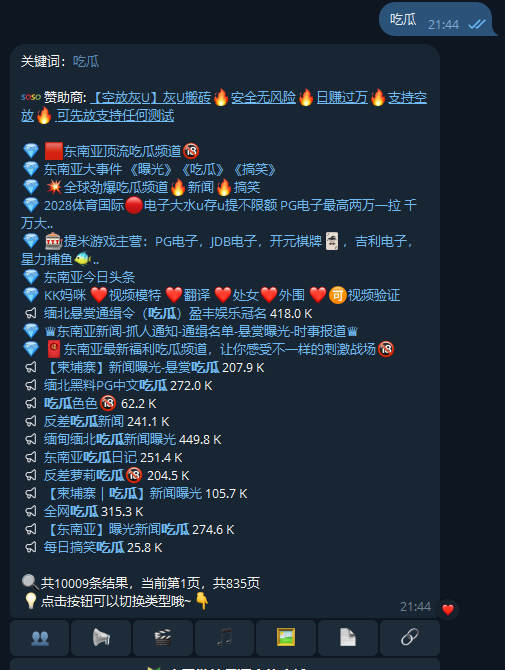

在信息爆炸的时代，如何高效获取自己想要的资源？Telegram搜索机器人为你带来全新解决方案，无需翻找频道、群组，只需输入关键词，即可一键查找海量内容。无论是影视剧、电子书、图片还是优质群组，Telegram搜索机器人都能帮你轻松找到。推荐搜索机器人：[@soso](https://t.me/soso?start=a_1453425105)、[@smss](https://t.me/smss?start=spread_1453425105)、[@jisou](https://t.me/jisou?start=a_1453425105)

<!-- more -->

## 什么是Telegram搜索机器人？

Telegram搜索机器人是一类专为Telegram用户打造的智能工具。它们可以帮助你快速检索频道、群组、文件、视频、图片等各种资源，极大提升信息获取效率。通过关键词搜索，用户可以在Telegram平台上快速定位所需内容，节省大量时间。[@soso](https://t.me/soso?start=a_1453425105)、[@smss](https://t.me/smss?start=spread_1453425105)、[@jisou](https://t.me/jisou?start=a_1453425105)

## Telegram搜索机器人的核心功能

- **关键词智能搜索**：输入你想要查找的内容，机器人自动匹配相关资源，精准高效。
- **多类型资源支持**：支持文档、图片、视频、音频等多种格式，满足不同需求。
- **实时更新**：资源库不断扩展，最新内容随时可查，紧跟热点。
- **操作简单**：无需复杂设置，直接在聊天窗口与机器人互动即可，适合所有用户。
- **隐私安全**：无需暴露个人信息，保护用户隐私，安全可靠。

## 推荐的Telegram搜索机器人

1. **极搜 [@jisou](https://t.me/jisou?start=a_1453425105)**  
   快速定位优质群组和频道，拓展你的社交圈，发现更多兴趣内容。

2. **搜搜 [@soso](https://t.me/soso?start=a_1453425105)**  
   专注文件搜索，适合查找文档、PDF、电子书等学习资源。

3. **神马搜索 [@smss](https://t.me/smss?start=spread_1453425105)**  
   支持多语言，检索速度快，适合日常资源查找，覆盖面广。

## 如何使用Telegram搜索机器人？

1. 点击以下链接，直接开始体验：[@soso](https://t.me/soso?start=a_1453425105)、[@smss](https://t.me/smss?start=spread_1453425105)、[@jisou](https://t.me/jisou?start=a_1453425105)
2. 进入聊天窗口，输入你想查找的关键词（如“吃瓜”、“电影”、“电子书”、“群组”）。

3. 等待机器人返回相关资源链接或文件，快速获取所需内容。

## Telegram搜索机器人的应用场景

- **影视剧查找**：输入片名即可获取下载或在线观看链接，追剧更方便。
- **电子书搜索**：直接搜索书名，机器人帮你定位资源，学习资料一键获取。
- **群组频道推荐**：输入兴趣关键词，快速找到相关频道和群组，拓展社交圈。

## 总结

Telegram搜索机器人让资源获取变得前所未有的简单和高效。无论你是学习、娱乐还是工作，都能在Telegram上轻松找到所需内容。赶快体验Telegram搜索机器人，让你的信息检索更智能、更高效！
