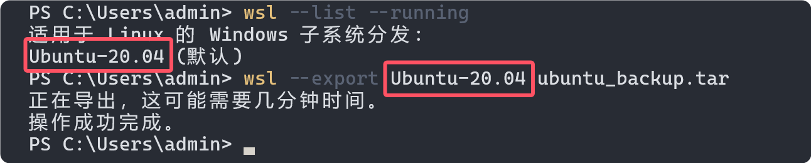
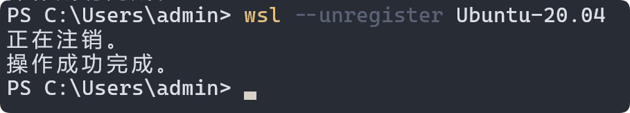
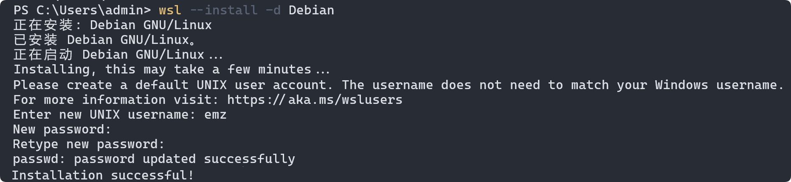

因为 debian 更稳定、更轻量，所以想把 wsl2 中的 ubuntu 换成 debian。

本文记录一下过程。

<!-- more -->

## 步骤 1: 导出当前的 Ubuntu 发行版

首先，需要将当前的 Ubuntu 发行版导出为一个 `.tar` 文件，以便以后可以恢复（如果需要的话）。

**以下命令都是在 Windows PowerShell 中运行的。**

```bash
# 确认当前的 Ubuntu 发行版名称
wsl --list --running
# 导出当前的 Ubuntu 发行版
wsl --export Ubuntu-20.04 ubuntu_backup.tar
```

这会将 Ubuntu 发行版导出到当前目录，并保存为 `ubuntu_backup.tar`。



上面命令中的 `Ubuntu-20.04` 可能会因为你的 Ubuntu 版本而有所不同。确保将其替换为你的 Ubuntu 发行版名称。

## 步骤 2: 卸载当前的 Ubuntu 发行版
接下来，卸载 Ubuntu 发行版：

```bash
wsl --unregister Ubuntu-20.04
```


这将删除现有的 Ubuntu 发行版，但不会影响导出的备份文件。

## 步骤 3: 安装 Debian 发行版
可以从 Microsoft Store 安装 Debian。如果你喜欢命令行安装，可以使用以下命令：

```bash
wsl --install -d Debian
```


这会自动安装最新版本的 Debian 发行版。首次运行时，Debian 会要求你创建一个新的用户和密码。

## 步骤 4: 恢复原来的数据（如果需要）
如果你想恢复 Ubuntu 发行版中的数据（比如在 Ubuntu 中安装的包或配置文件），可以将 `ubuntu_backup.tar` 文件导入到 Debian 中：

```bash
wsl --import Debian-Backup <新安装路径> ubuntu_backup.tar --version 2
```

这将恢复你导出的 Ubuntu 数据到 Debian 发行版中。

## 步骤 5: 进入 Debian
通过以下命令进入新的 Debian 环境：

```bash
wsl -d Debian
```

完成这些步骤后，你就成功地将 WSL2 环境中的 Ubuntu 更换为 Debian。

如果之前用的 WindowsTerminal，记得改一下默认启动项。

