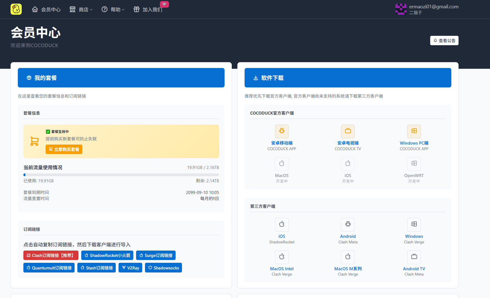
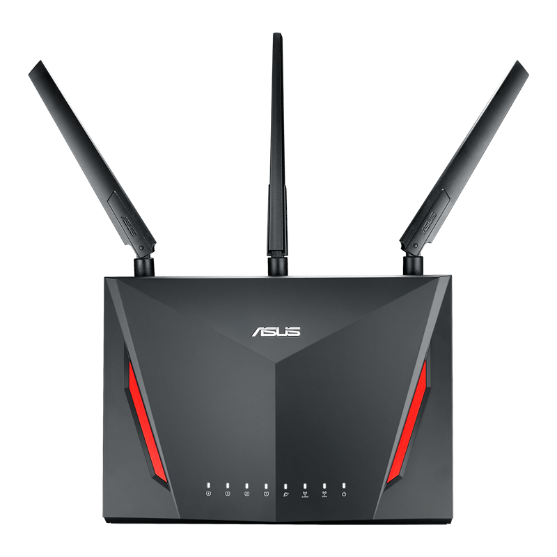
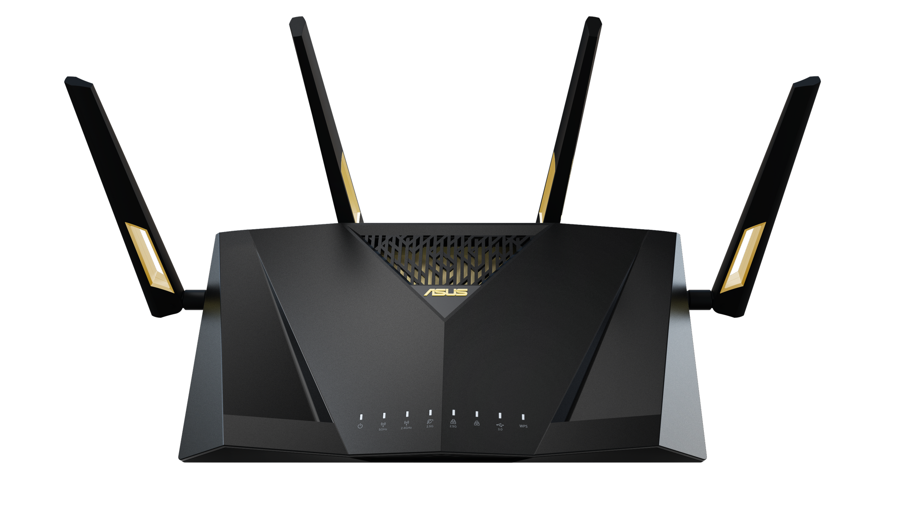
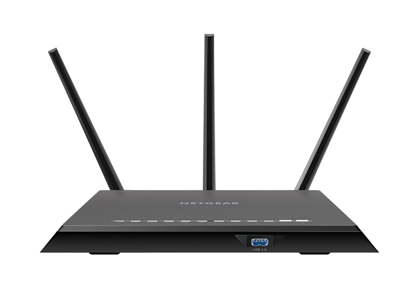
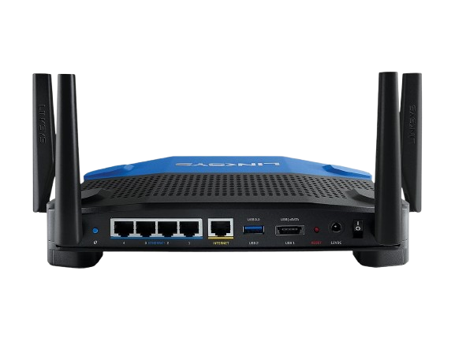
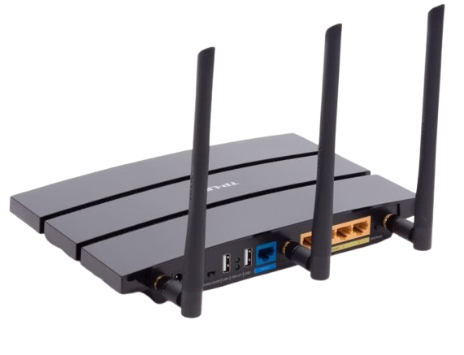

路由器翻墙是实现全家设备科学上网的最佳解决方案。通过在路由器上配置VPN，智能电视、游戏机、手机、电脑等所有设备都能自动获得翻墙能力，无需单独安装VPN软件。

本教程包含华为、小米、TP-Link路由器的VPN配置方法，推荐2025年最佳路由器VPN（SSONE机场、CocoDuck机场），提供路由器选择指南和性能优化技巧。支持解锁Netflix、YouTube、ChatGPT等海外服务，月付仅需10元起。

<!-- more -->

# 路由器翻墙详细教程：2025年最佳路由器VPN配置指南

## 目录导航

- [路由器VPN翻墙的基本要求](#路由器vpn翻墙的基本要求)
- [路由器翻墙的主要优势](#路由器翻墙的主要优势)
- [路由器翻墙的潜在限制](#路由器翻墙的潜在限制)
- [2025年顶级路由器VPN推荐](#年顶级路由器vpn推荐2025年)
- [路由器VPN选择标准](#路由器vpn选择标准)
- [最佳翻墙路由器设备推荐](#最佳翻墙路由器设备推荐)
- [华为路由器VPN配置教程](#华为路由器vpn配置教程)
- [小米路由器翻墙设置方法](#小米路由器翻墙设置方法)
- [TP-Link路由器VPN安装指南](#tp-link路由器vpn安装指南)
- [路由器翻墙方案总结](#路由器翻墙方案总结)

## 什么是路由器翻墙？

路由器翻墙是指在无线路由器上配置VPN服务，让连接到该路由器的所有设备都能够通过VPN加密通道访问被封锁的网站和服务。这种方法可以让智能手机、电脑、平板、智能电视、游戏机等设备自动获得翻墙能力，无需在每台设备上单独安装VPN客户端。

## 路由器VPN翻墙的基本要求

### 硬件兼容性检查

在开始配置路由器VPN之前，需要确认以下几个关键条件：

**路由器VPN功能支持**
- 路由器原生支持VPN客户端功能（如部分华硕、网件高端型号）
- 支持刷写第三方固件（OpenWRT、DD-WRT、Merlin等）
- 具备足够的硬件性能处理VPN加密

**VPN服务兼容性**
- 选择支持路由器配置的VPN服务商
- 确认VPN提供商提供OpenVPN或其他路由器兼容协议
- 验证VPN服务在中国大陆的连接稳定性

**网络环境要求**
- 稳定的宽带网络连接
- 充足的网络带宽支持VPN加密传输
- 合适的网络设置环境

## 路由器翻墙的主要优势

### 1. 全设备网络保护

路由器VPN最大的优势是能为所有连接设备提供统一的网络保护：

- **多设备同时翻墙**：手机、电脑、平板、智能电视等设备自动获得VPN保护
- **设备无感知配置**：设备无需安装任何VPN软件，连接WiFi即可翻墙
- **家庭网络统一管理**：一次配置，全家设备受益

### 2. 特殊设备翻墙解决方案

许多设备无法直接安装VPN客户端，路由器翻墙为这些设备提供了完美解决方案：

- **智能电视翻墙**：直接观看Netflix、YouTube、Disney+等海外流媒体
- **游戏主机翻墙**：PlayStation、Xbox、Nintendo Switch等游戏设备访问海外服务
- **物联网设备**：智能音箱、摄像头等IoT设备的网络保护

### 3. 网络安全性提升

- **统一加密保护**：所有设备流量通过路由器VPN加密传输
- **隐私保护增强**：隐藏真实IP地址，防止网络监控
- **公共WiFi安全**：在公共场所使用时提供额外安全保护

### 4. 成本效益优化

- **绕过设备限制**：一个VPN账号保护多台设备，突破同时连接数限制
- **长期成本节约**：避免为每台设备单独购买VPN服务
- **管理便捷性**：集中管理比分散配置更经济高效

## 路由器翻墙的潜在限制

### 技术配置复杂性

路由器VPN配置相比单设备VPN安装更具挑战性：

- **技术门槛较高**：需要了解路由器管理、网络配置等技术知识
- **刷机风险**：第三方固件安装可能导致路由器变砖
- **故障排除困难**：网络问题诊断和解决需要专业知识

### 硬件性能要求

- **处理器性能需求**：VPN加密解密需要消耗大量CPU资源
- **内存容量限制**：固件和VPN软件运行需要足够内存空间
- **网速影响**：硬件性能不足可能导致网速明显下降

### 使用灵活性限制

- **服务器切换不便**：更换VPN服务器需要重新配置路由器
- **分流功能受限**：无法像客户端软件那样灵活设置应用分流
- **高级功能缺失**：部分VPN高级功能在路由器上无法使用

## 顶级路由器VPN推荐2025年

### SSONE机场 - 路由器翻墙首选方案


**为什么选择SSONE机场用于路由器翻墙？**

[SSONE机场](https://hello-ssone.com/register?aff=aBHsE1pF)是目前最适合路由器翻墙的机场服务，具有以下突出优势：

**技术优势**
- **高速协议**：支持多种现代化协议，连接速度快，延迟低
- **稳定连接**：专门针对中国网络环境优化的节点配置
- **多协议支持**：兼容OpenVPN、V2Ray、Trojan等多种协议

**中国大陆优化**
- **周边节点覆盖**：香港、日本、新加坡、韩国等地优质节点
- **GFW绕过能力**：专门针对中国网络环境优化的连接技术
- **稳定性保证**：在网络封锁加剧时期依然保持高连接成功率

**路由器兼容性**
- **多协议支持**：支持OpenVPN等路由器兼容协议
- **配置简单**：提供详细的路由器配置教程
- **广泛兼容**：支持各种路由器固件配置

**性能表现**
- **速度优秀**：高速节点确保流畅的网络体验
- **全球节点**：覆盖主要国家和地区，满足不同访问需求
- **流媒体解锁**：稳定解锁Netflix、YouTube、Disney+等平台

**服务保障**
- **高性价比**：10元60G/月，价格实惠
- **稳定服务**：可靠的服务质量保证
- **支持ChatGPT**：解锁各种AI服务

**当前优惠价格**
- 基础套餐：10元60G/月
- 性价比极高的翻墙解决方案

[立即注册SSONE机场](https://hello-ssone.com/register?aff=aBHsE1pF)

### CocoDuck机场 - 高性价比路由器VPN选择



**CocoDuck机场路由器翻墙优势**

[CocoDuck机场](https://cocoduck.live/auth/register?code=25c8b515df)作为知名机场品牌，在路由器翻墙方面提供了出色的稳定性选择：

**全球服务器网络**
- **广泛覆盖**：40+全球节点，覆盖主要国家和地区
- **亚洲优化**：在香港、日本、新加坡等地部署优质节点
- **流媒体专用**：专门优化的流媒体解锁服务器

**安全技术特性**
- **多协议支持**：支持V2Ray、Trojan等现代化协议
- **隐私保护**：严格的无日志政策，保护用户隐私
- **安全功能**：高级加密技术，确保连接安全

**路由器支持**
- **多品牌兼容**：支持华硕、Linksys、网件等主流品牌
- **固件支持**：兼容OpenWRT、DD-WRT等第三方固件
- **配置教程**：提供详细的路由器配置指南

**服务优势**
- **稳定运营**：两年稳定运营历史，信誉可靠
- **自有机房**：拥有四个自有机房，确保服务质量
- **技术支持**：专业的技术支持团队

**特色功能**
- **OpenAI解锁**：支持ChatGPT等AI服务访问
- **流媒体解锁**：稳定解锁Netflix、YouTube等平台
- **海外团队**：由海外专业团队运营维护

[立即注册CocoDuck机场](https://cocoduck.live/auth/register?code=25c8b515df)

## 路由器VPN选择标准

### 性能指标评估

**连接稳定性**
- 在中国大陆的连接成功率
- 网络波动时的重连能力
- 长时间使用的稳定性表现

**速度性能**
- VPN加密对网速的影响程度
- 不同时段的速度稳定性
- 高峰期的性能表现

### 安全功能评估

**加密技术**
- 加密算法强度（推荐AES-256）
- 密钥交换协议安全性
- 完美前向保密支持

**隐私保护**
- 无日志政策的严格程度
- 公司所在地的法律环境
- 独立审计验证情况

### 兼容性检查

**路由器品牌支持**
- 主流路由器品牌官方支持
- 第三方固件兼容性
- 配置教程的完整性

**协议支持**
- OpenVPN协议支持
- 其他路由器兼容协议
- 自动配置工具提供

### 服务质量评估

**技术支持**
- 客服响应速度和专业程度
- 中文支持能力
- 技术问题解决效率

**价格性价比**
- 订阅价格合理性
- 同时连接设备数限制
- 退款政策的友好程度

## 最佳翻墙路由器设备推荐

### 华硕（ASUS）路由器系列

#### ASUS RT-AC86U - 高性价比家用首选



**产品特点**
- **双核处理器**：1.8GHz双核CPU，VPN性能出色
- **WiFi性能**：AC2900双频无线，覆盖范围广
- **VPN支持**：原生支持多种VPN协议
- **固件选择**：支持原厂固件和Merlin固件

**适用场景**
- 中等面积家庭使用
- 多设备同时翻墙需求
- 对网速要求较高的用户

**配置优势**
- 原生VPN客户端支持
- 简单的Web界面配置
- 稳定的VPN连接性能

#### ASUS RT-AX88U - 旗舰级WiFi 6路由器



**高端性能**
- **四核处理器**：1.8GHz四核CPU，顶级性能
- **WiFi 6支持**：最新无线标准，速度更快
- **大内存**：1GB RAM，运行更流畅
- **多端口**：8个千兆LAN端口

**技术优势**
- 支持最新VPN协议
- 优秀的多设备并发处理能力
- 企业级网络功能

### 网件（NETGEAR）Nighthawk系列

#### NETGEAR R7000 - 经典稳定选择



**产品优势**
- **成熟稳定**：市场验证时间长，稳定性出色
- **第三方支持**：广泛的DD-WRT固件支持
- **性价比高**：价格适中，功能全面
- **社区支持**：丰富的用户社区和教程资源

**VPN性能**
- 支持多种VPN协议
- 第三方固件VPN功能强大
- 适合技术爱好者深度定制

### Linksys WRT系列

#### Linksys WRT3200ACM - 开源固件首选



**开源特性**
- **开源友好**：官方支持OpenWRT固件
- **高性能**：1.8GHz双核处理器，512MB内存
- **可扩展性**：丰富的固件功能扩展

**技术优势**
- 完全开源的固件环境
- 灵活的VPN配置选项
- 强大的网络功能定制能力

### TP-Link路由器系列

#### TP-Link Archer C7 - 入门级经济选择



**经济实用**
- **价格亲民**：适合预算有限的用户
- **基本功能**：满足基础翻墙需求
- **固件支持**：支持OpenWRT第三方固件

**适用人群**
- 轻度翻墙需求用户
- 技术入门学习者
- 小面积住宅使用

## 华为路由器VPN配置教程


### 华为路由器翻墙可行性分析

华为路由器在VPN支持方面相对保守，大多数消费级型号（如AX3、AX3 Pro、WS5200等）默认不提供VPN客户端功能。但通过以下方法仍可实现翻墙：

**支持的华为路由器型号**
- WS5200四核版
- AX3 Pro
- AX6
- WS7100
- AX2
- WS8200系列

### 华为路由器翻墙配置步骤

#### 方法一：利用内置VPN功能（部分型号）

**步骤1：登录管理界面**
1. 在浏览器输入 `192.168.3.1` 或 `192.168.1.1`
2. 输入管理员密码登录
3. 进入"我要上网"或"网络设置"页面

**步骤2：查找VPN设置**
1. 在高级设置中寻找"VPN"选项
2. 如无VPN选项，则需要使用方法二

**步骤3：配置VPN连接**
1. 选择VPN协议类型（推荐OpenVPN）
2. 上传VPN配置文件(.ovpn格式)
3. 输入VPN服务商提供的用户名和密码
4. 保存并启动连接

#### 方法二：刷写第三方固件（高级用户）

**前期准备**
1. 确认路由器型号支持刷机
2. 下载对应的OpenWRT固件
3. 备份原厂固件（重要！）
4. 准备网线连接设备

**刷机步骤**
1. 路由器进入恢复模式
2. 通过Web界面上传固件
3. 等待刷机完成（约5-10分钟）
4. 重新配置网络设置

**VPN配置**
1. 登录OpenWRT管理界面
2. 安装OpenVPN客户端插件
3. 上传VPN配置文件
4. 配置网络路由规则

### 华为路由器翻墙注意事项

**风险提醒**
- 刷机操作有变砖风险，请谨慎操作
- 刷机后将失去官方保修服务
- 建议备份原厂固件以便恢复

**性能考虑**
- 华为路由器CPU性能相对较弱
- VPN加密可能影响网速较多
- 建议选择轻量级VPN协议

## 小米路由器翻墙设置方法


### 小米路由器VPN支持现状

小米路由器系统基于OpenWRT深度定制，但官方固件通常不提供VPN客户端功能。以下型号支持第三方固件刷写：

**兼容型号列表**
- 小米路由器3（R3）
- 小米路由器4（R4）
- 小米路由器AC2100
- 小米路由器AX1800
- 小米路由器AX3600
- 小米路由器AX6000

### 小米路由器翻墙配置流程

#### 准备工作

**固件准备**
1. 下载小米路由器专用的OpenWRT固件
2. 确认固件版本与路由器型号匹配
3. 准备VPN服务商的配置文件

**工具准备**
- SSH工具（如PuTTY）
- 网线连接
- 电脑浏览器

#### 详细配置步骤

**第一步：开启SSH访问**
1. 登录小米路由器管理页面（`192.168.31.1`）
2. 在系统设置中找到"开发者选项"
3. 开启SSH功能并设置密码

**第二步：安装第三方固件**
1. 通过SSH连接路由器
2. 上传OpenWRT固件文件
3. 执行刷机命令：`mtd write firmware.bin OS1`
4. 重启路由器等待固件安装完成

**第三步：配置OpenWRT系统**
1. 通过浏览器访问新的管理界面
2. 设置网络连接参数
3. 安装必要的软件包

**第四步：安装VPN客户端**
```bash
# 更新软件包列表
opkg update

# 安装OpenVPN客户端
opkg install openvpn-openssl

# 安装LuCI界面插件
opkg install luci-app-openvpn
```

**第五步：配置VPN连接**
1. 上传VPN配置文件到 `/etc/openvpn/`
2. 在LuCI界面中配置VPN连接
3. 设置自动启动和网络路由

### 小米路由器翻墙优化建议

**性能优化**
- 选择性能较强的小米路由器型号
- 使用轻量级VPN协议减少性能损耗
- 合理配置内存和存储空间

**稳定性提升**
- 定期更新固件版本
- 监控路由器温度和负载
- 设置VPN连接自动重连

## TP-Link路由器VPN安装指南


### TP-Link路由器VPN原生支持

TP-Link部分型号提供了原生VPN客户端支持，配置相对简单：

**支持VPN的TP-Link型号**
- Archer C7（V2-V5）
- Archer A7
- Archer C1200
- Archer AX50
- Archer C2300
- Archer AX73

### TP-Link原生VPN配置教程

#### 登录和基础设置

**第一步：访问管理界面**
1. 浏览器打开 `http://192.168.0.1` 或 `http://tplinkwifi.net`
2. 输入默认用户名密码（通常是admin/admin）
3. 进入路由器管理页面

**第二步：找到VPN设置**
1. 点击"高级"菜单
2. 选择"VPN客户端"或"VPN"选项
3. 如果没有此选项，说明该型号不支持原生VPN

#### VPN连接配置

**OpenVPN配置方式**
1. 选择"OpenVPN"协议类型
2. 点击"上传"按钮选择.ovpn配置文件
3. 文件上传后系统自动解析连接参数
4. 输入VPN服务商提供的用户名和密码
5. 点击"连接"开始建立VPN通道

**L2TP/IPSec配置方式**
1. 选择"L2TP/IPSec"协议
2. 手动输入以下信息：
   - 服务器地址
   - 用户名和密码
   - 预共享密钥（PSK）
3. 保存配置并启动连接

#### 连接测试和验证

**验证VPN连接状态**
1. 在VPN客户端页面查看连接状态
2. 确认显示"已连接"状态
3. 记录分配的虚拟IP地址

**网络访问测试**
1. 尝试访问Google、YouTube等网站
2. 使用IP检测网站确认IP地址已更改
3. 测试网络速度是否满足需求

### TP-Link第三方固件方案

对于不支持原生VPN的TP-Link型号，可以考虑刷写第三方固件：

#### OpenWRT固件安装

**兼容性检查**
1. 访问OpenWRT官网查询设备支持列表
2. 确认路由器硬件版本
3. 下载对应的固件文件

**刷机准备**
1. 备份原厂固件（非常重要）
2. 准备TFTP服务器软件
3. 设置电脑网络连接

**固件安装过程**
1. 路由器断电后按住Reset键
2. 通电同时继续按住Reset键10秒
3. 通过TFTP上传OpenWRT固件
4. 等待固件安装完成并重启

#### DD-WRT固件选择

**DD-WRT优势**
- 图形化界面友好
- VPN配置相对简单
- 社区支持丰富

**安装注意事项**
- 确认型号完全匹配
- 注意硬件版本差异
- 遵循详细的刷机教程

### TP-Link路由器VPN优化技巧

**性能调优**
- 选择合适的VPN加密强度
- 优化MTU大小设置
- 监控CPU和内存使用率

**稳定性保障**
- 设置VPN自动重连
- 配置故障转移机制
- 定期重启保持稳定

## 路由器翻墙方案总结

### 最佳VPN服务推荐

经过全面测试和用户反馈，以下是2025年最值得推荐的路由器VPN服务：

#### 首选方案：SSONE机场


[SSONE机场](https://hello-ssone.com/register?aff=aBHsE1pF)详细评测：10元60G/月的高性价比翻墙机场，稳定可靠、速度快、支持Netflix和ChatGPT，是2025年最值得推荐的便宜机场之一。

SSONE机场官网地址：[https://hello-ssone.com](https://hello-ssone.com/register?aff=aBHsE1pF)

#### 备选方案：CocoDuck机场


[CocoDuck机场](https://cocoduck.live/auth/register?code=25c8b515df)
由海外团队运营的高品质翻墙机场，拥有两年稳定运营历史、自有四个机房、40+全球节点，支持OpenAI和流媒体解锁，是2025年最值得信赖的稳定机场之一。

CocoDuck机场官网地址：[https://cocoduck.live](https://cocoduck.live/auth/register?code=25c8b515df)

### 路由器选择建议

**家庭用户推荐**
- **ASUS RT-AC86U**：性价比最高，配置简单
- **NETGEAR R7000**：稳定性出色，社区支持丰富
- **TP-Link Archer C7**：入门级选择，价格亲民

**高端用户推荐**
- **ASUS RT-AX88U**：旗舰性能，WiFi 6支持
- **Linksys WRT3200ACM**：开源固件首选
- **NETGEAR Nighthawk系列**：企业级功能

### 配置成功关键要素

**技术准备**
1. 确认路由器VPN兼容性
2. 选择合适的VPN服务商
3. 准备必要的技术工具

**配置流程**
1. 备份原始设置
2. 按步骤配置VPN连接
3. 测试连接稳定性
4. 优化性能参数

**维护管理**
1. 定期检查连接状态
2. 及时更新固件版本
3. 监控网络性能表现

### 常见问题解决

**连接问题**
- 检查VPN服务器状态
- 尝试更换连接协议
- 重置网络设置

**速度问题**
- 选择就近服务器
- 调整加密级别
- 优化路由器性能

**稳定性问题**
- 设置自动重连
- 监控硬件温度
- 定期重启设备

通过路由器翻墙，可以为家庭网络提供全面的隐私保护和网络自由访问能力。选择合适的VPN服务和路由器设备，配合正确的配置方法，就能享受安全、稳定、高速的翻墙体验。

无论选择[SSONE机场](https://hello-ssone.com/register?aff=aBHsE1pF)的高性价比方案，还是[CocoDuck机场](https://cocoduck.live/auth/register?code=25c8b515df)的稳定服务，都能满足不同用户的翻墙需求。重要的是根据自己的技术水平、预算情况和使用需求，选择最适合的解决方案。

## 其他

### 机场汇总

[https://www.ermao.net/posts/vpn](https://www.ermao.net/posts/vpn)

### 客户端使用方法

- 📱 [clash for Android](https://www.ermao.net/article/eh8f4n86/)
- 🖥 [clash for Windows](https://www.ermao.net/article/0gematwc/)
- 🍎 [clash for iOS](https://www.ermao.net/article/z747kgjd/)