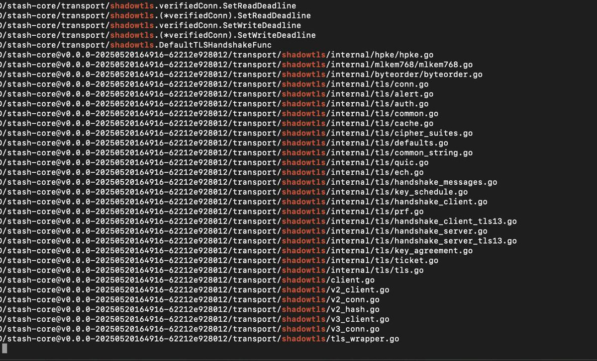
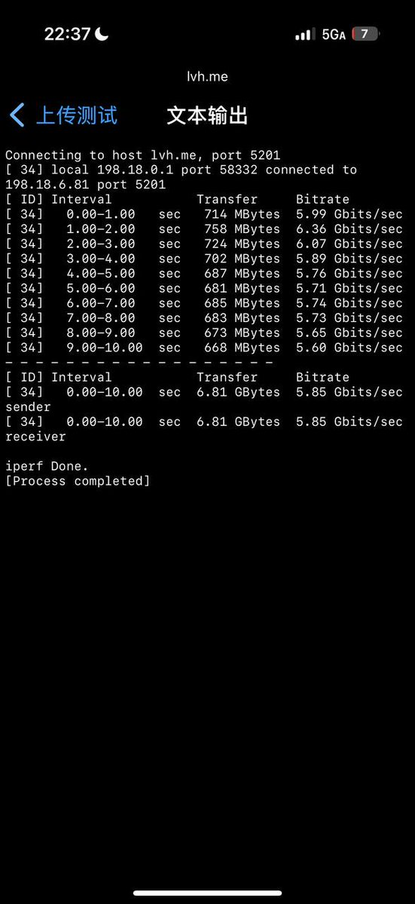
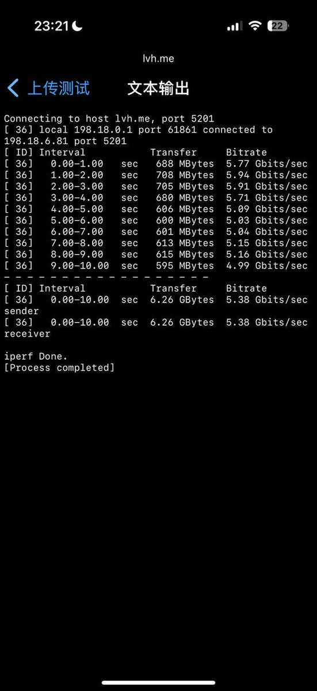
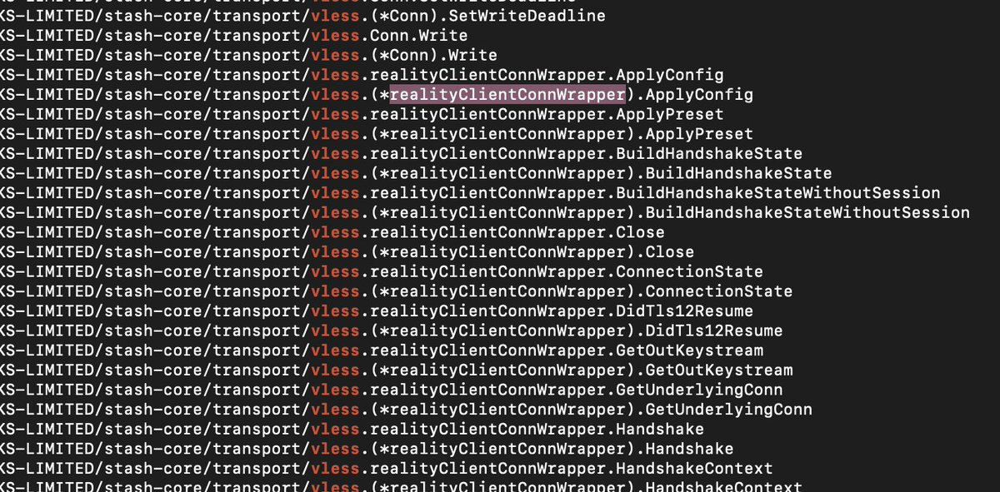
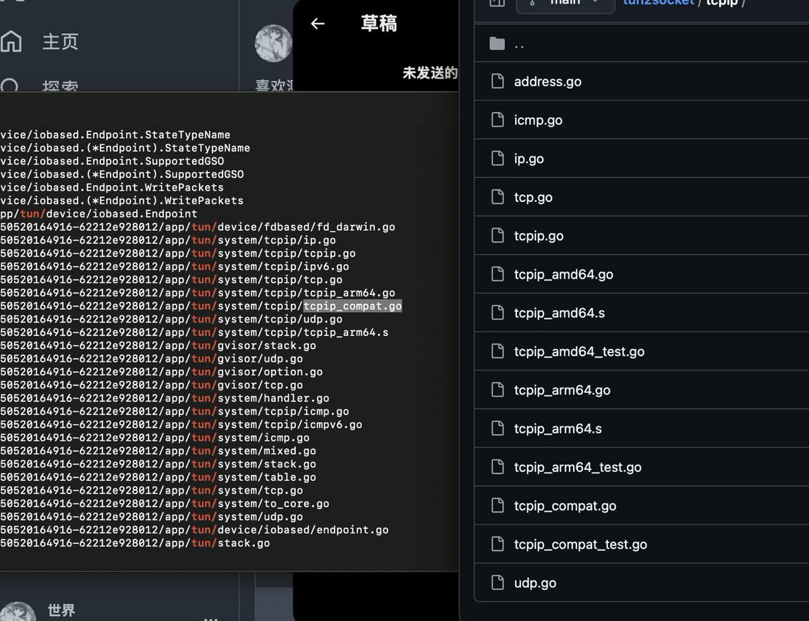
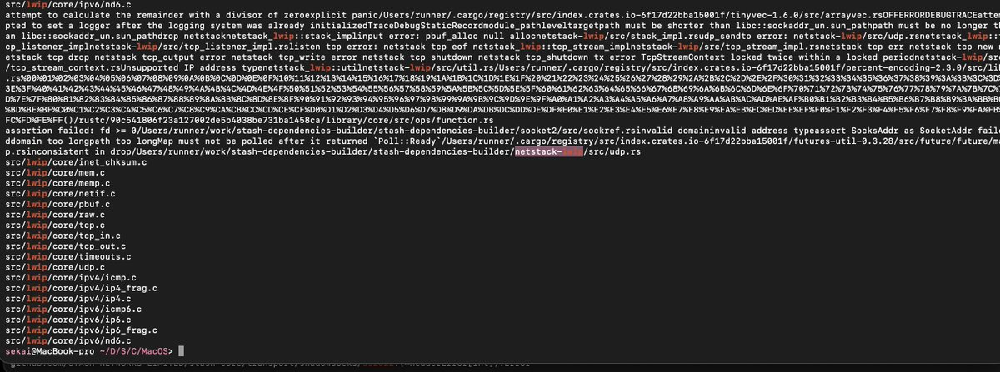
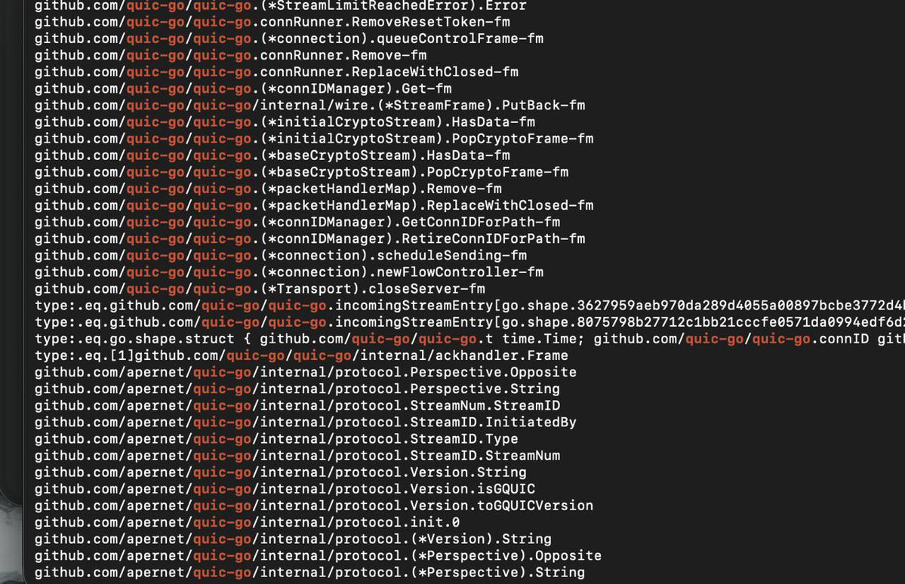

接群友匿名投稿，知名代理软件 Stash Mac 涉嫌大量复制粘贴开源代码，涉及多个GPL、AGPL协议下的代码库。

爆料源：[https://x.com/nek0hasekai/status/1941361311130235189](https://x.com/nek0hasekai/status/1941361311130235189)

<!-- more -->

## Stash Mac 客户端涉嫌抄袭开源代码

据爆料源，Stash Mac 客户端的核心代码（时间戳20250520） 被指控“缝合”多项知名开源项目：

- Shadow-TLS： 疑似完全⬅️ SagerNet/sing-box （GPL授权）。Singbox 开发者公开指控 Stash Mac 抄袭其 Shadow-TLS 实现。
- SS2022： 疑似部分⬅️ database64128/shadowsocks-go （AGPL授权）。
- Vless： 疑似部分⬅️ SagerNet/sing-box （GPL授权）。
- Tun 的 system 栈： 疑似部分⬅️ Kr328/tun2socket（MIT 授权）。

爆料源还称，Stash Mac 在复制粘贴代码时，甚至忘了对 quic-go 依赖 去重，导致其在代码中重复出现两遍。

::: collapse

- GPL与AGPL协议的版权简介

  GPL协议（GNU General Public License）是开源社区的重要基石，其核心特点是“传染性”。这意味着，如果一个软件 完整或部分 使用了GPL协议的代码并进行分发，那么该软件的整体也必须以GPL协议开源，并提供完整的源代码。

  AGPL协议（GNU Affero General Public License）则是GPL的延伸，专为网络服务（SaaS）设计。它规定，即使软件没有被直接“分发”给用户，只要通过网络向用户提供服务并使用了AGPL许可的代码，服务提供方就必须向用户提供其所使用的、修改后的完整源代码。

:::

## Stash Mac 的代码结构与 SagerNet/sing-box 完全一致，甚至连文件名都没有修改。

为什么说除了 Surge 和火箭以外的苹果代理都不要买，因为他们根本没有自己实现协议的能力，可以相信其他东西实现的也不咋地。

图片内容来自 Stash 官网下载 macOS 客户端 + strings | grep

shadow-tls 部分完全复制我的 GPL 代码，文件结构完全一样。

> 我们现在在 iOS 上虽然比不上还没发布的 Surge 6，但甚至比 Surge 5 快！
>
> sing-box tf 1.12.0-beta.31 9.9G （p1）
>
> Surge 5 tf build 3516 5.8G（p2）
>
> Surge 5 商店版 5.3G （p3）
>
> 设备 iPhone 16 pro
>
> 其他软件太慢了就不放了，不过还发现了点有意思的事情，等会发

ss2022 部分可以相信是来自 AGPL 的 database64128/shadowsocks-go，结构命名非常相似

vless 部分某些代码与 sing-box 的命名一致

tun 的 system stack 部分来自 kr328/tun2socket （原 ClashForAndroid 使用），不过授权是 MIT 用了也不算侵权。

tun 的 system stack 部分来自 kr328/tun2socket （原 ClashForAndroid 使用），不过授权是 MIT 用了也不算侵权。

tun 的 lwip stack 部分可能来自开源代理软件 leaf 作者 eycorsican 的 netstack-lwip，需要注意的是这个库没有 license，也就是说版权所有不可以使用。

我相信其他协议实现部分肯定还复制了（包括 mihomo、我的和其他人的）GPL 代码，不过代码量少不反编译就没办法一眼实锤，懒得继续找了。

