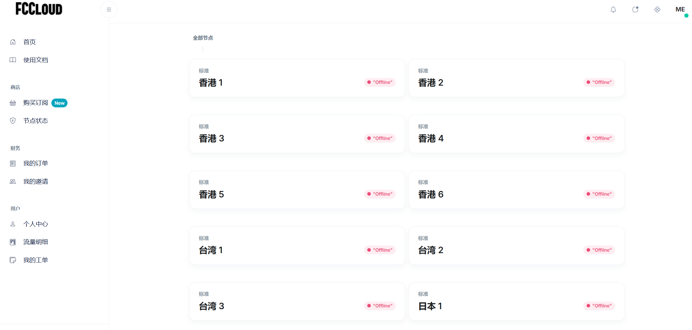
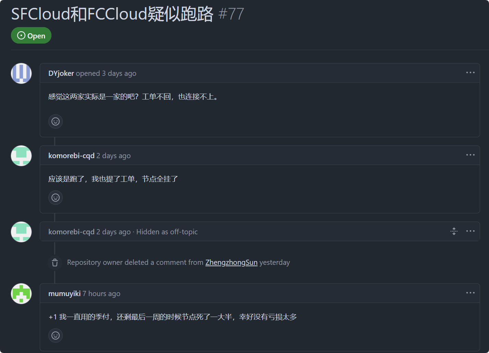

2025年2月11日，SFCloud 和 FCCloud 疑似跑路，官网可以法访问，节点全部无法使用，工单不回。

高度预警！立即停止续费，避免损失。

<!-- more -->

## 推测

SFCloud 与 FCCloud 起初由 EFCloud 引流，如今 EFcloud 已经于 2025年1月25日跑路，SFCloud 和 FCCloud 大概率跑路！

相关文章：[⚠️【机场跑路】2025年1月25日EFCloud机场跑路](/article/nz313xp6/)

## FCCloud 节点无法使用截图

## 网友预警

## 机场跑路（预警）投稿

[点击投稿](https://pyjichang.com/scamvpn/)

## 其他推荐机场

::: warning
任何机场都有跑路的风险，建议备份几个按流量付费机场防止失联，同时主力机场使用月付费，尽可能减少损失。
:::

[https://www.ermao.net/posts/vpn](https://www.ermao.net/posts/vpn)